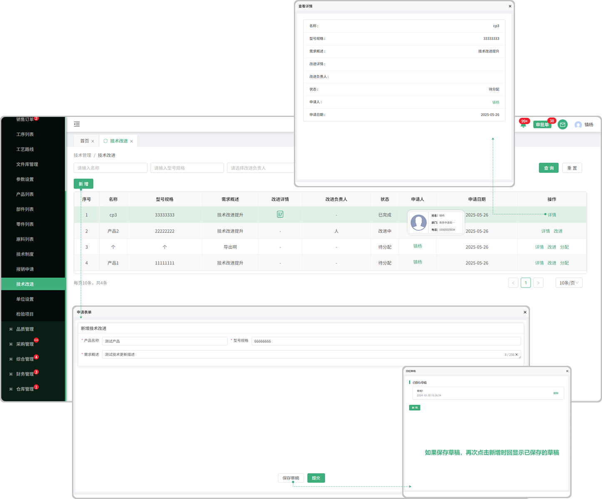
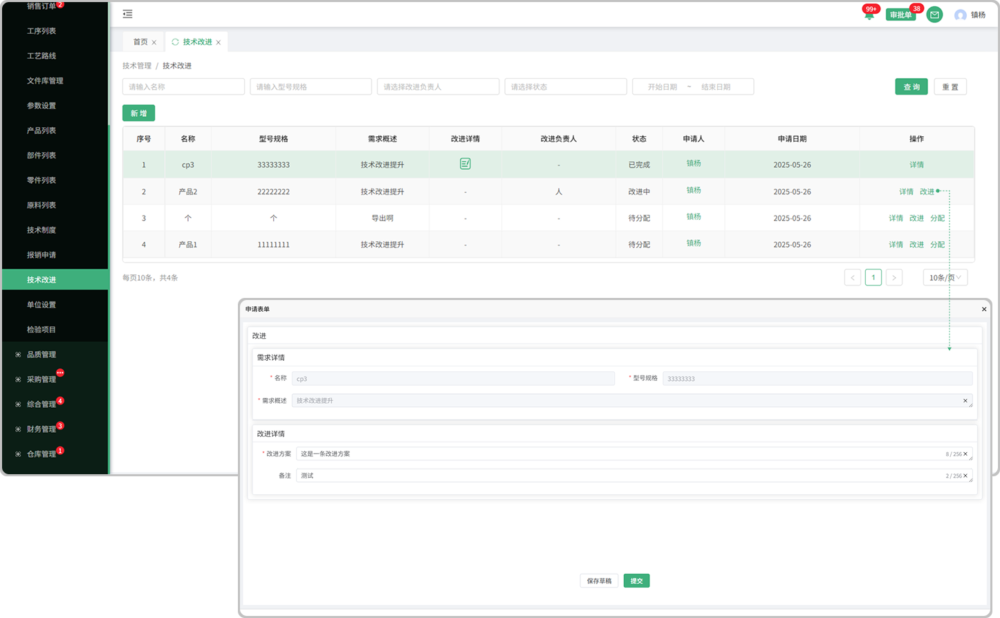
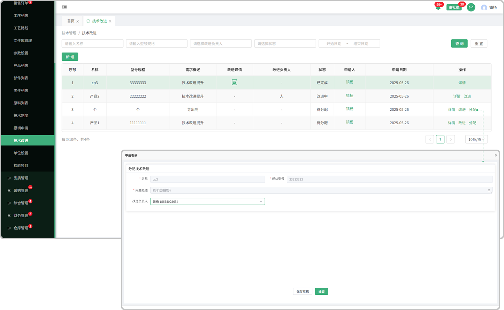

# 技术改进

> "技术改进"位于技术管理板块，在"技术改进列表"中新增相对应的"技术改进单据" 可以指定改进方案和分配(分配某个人去完成)

#### 1. 新增

* 新增:点击新增 "技术改进"完成 "提交" 后,页面操作显示:详情  改进  分配

#### 2.详情

* 详情:点击详情可查看名称，型号规格，需求概述，改进详情，改进负责人，状态，申请人，申请日期

#### 3.保存草稿

* 保存草稿:保存草稿后,在点击新增的时候回显示之前保存的草稿

#### 4.改进

* 改进: 点击改进可填写改进的:方案 \ 备注 \ 完成时间(如果 "改进完成" 就不能分配了,可以 "分配完成" 在去改进)

 

#### 5。分配

* 分配: 点击分配,可以指定分配给某个人

