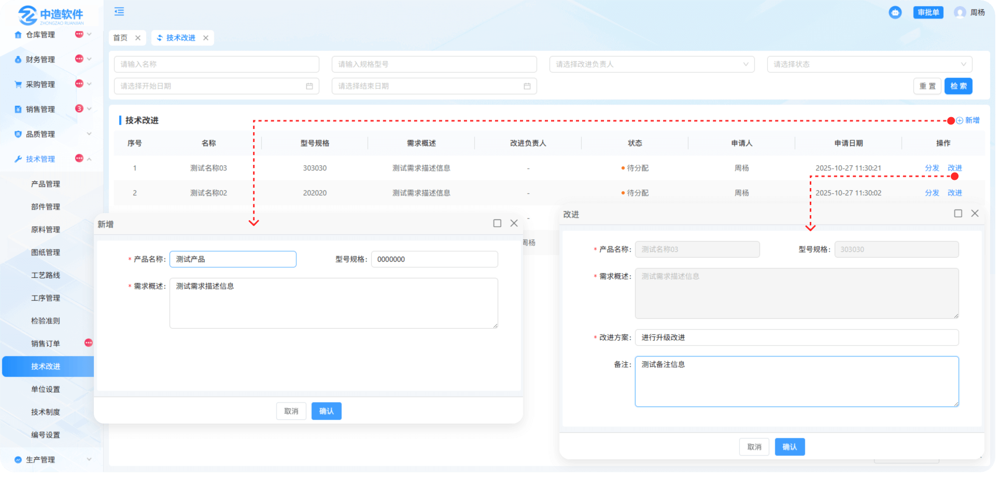
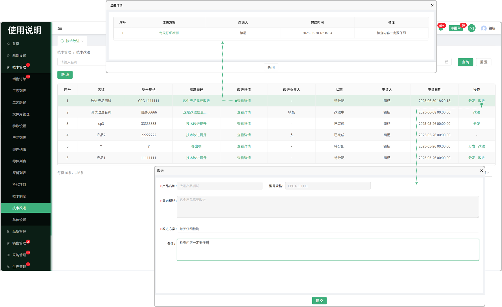

# 技术改进

> "技术改进"位于技术管理板块，在"技术改进列表"中新增相对应的"技术改进单据" 可以指定改进方案和分发(分发某个人去完成)

#### 1. 新增

* 新增:点击“新增”完成后点击 "提交"，页面操作显示: 详情  分发  改进 

#### 2.改进

* 改进: 点击改进可填写改进的方案及备注信息(如果 "改进完成" 就不能分发了,可以 "分发完成" 再去改进)

#### 3.分发

* 可分发给某个人去完成改进内容

#### 4.详情

* 改进成功后可点击详情查看当前技术改进内容

