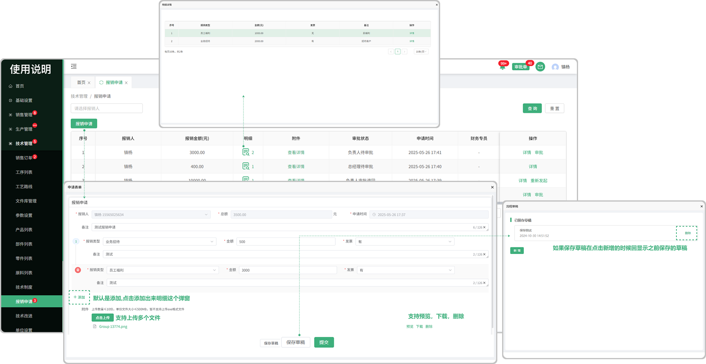
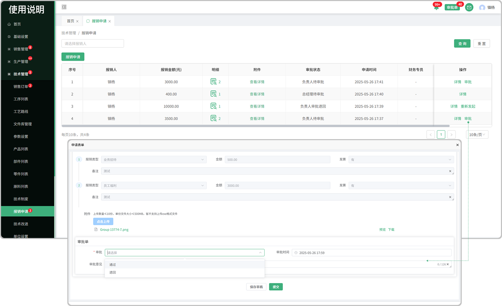
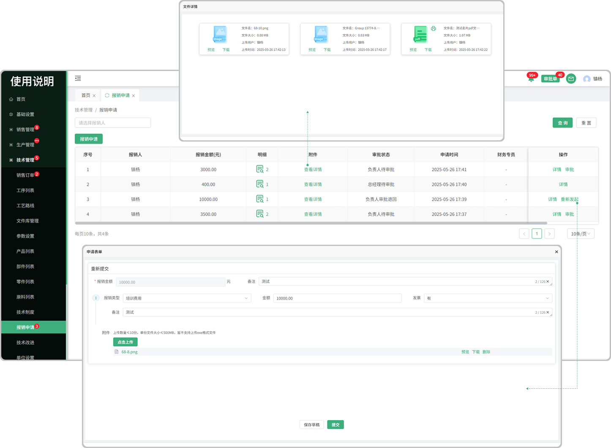

# 报销申请

> "报销申请"位于技术管理板块，在"报销申请列表"中新增相对应的 "报销单子" 通过负责人审批,以及总经理审批得到结果
#### 1. 报销申请

* 报销申请：当前页面可以添加 "报销申请"  在创建申请表单的时候可以 "新增" 多个明细,同时可上传多个文件，上传的文件支持预览，删除，下载
* 提交：提交以后界面显示 "详情" "和审批"
* 草稿：保存草稿后在点击新增的时候会显示之前保存的草稿

#### 2.明细

* 新增的报销申请提交完成以后会生成明细，点击可查看明细记录
  
  -图标旁数字代表这个单子里面有多少条明细记录

#### 3.审批

* 审批：点击审批,由负责人审批,如果审批 "通过" 界面显示 "详情" 如果 "不通过" 界面显示 "重新发起"
* 提交：提交以后界面上方"审批单" 提示信息 最终还需要总经理去审批,如果审批 "通过" 界面显示 "详情" 如果 "不通过" 界面显示 "重新发起"

#### 4.附件

* 在新增报销申请时所上传的文件，点击查看详情，支持预览，下载，pdf打印

重新发起：提交审批的单子，不通过或被退回了，则需重新发起再次提交，等待审批

