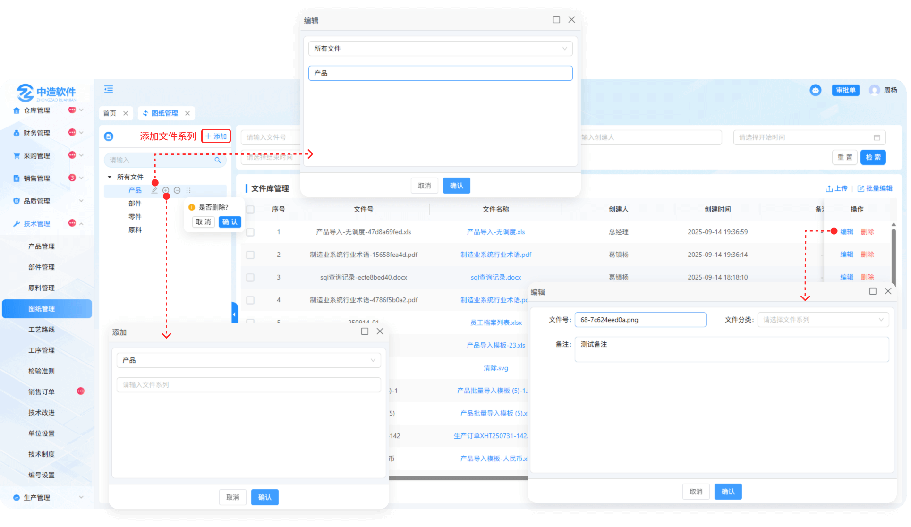
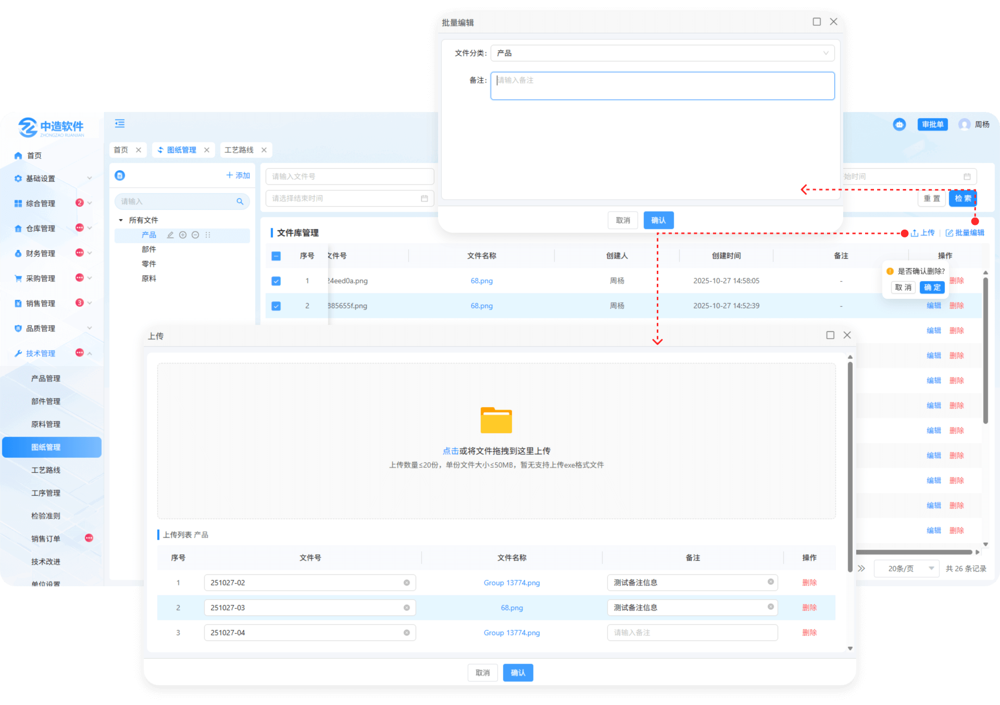

# 文件库管理

> 文件库管理列表位于技术管理板块，在文件库管理列表中可上传文件，支持删除、文件名称搜索等操作

#### 1.分类树

* 左侧展示文件分类树，点击可展开或收起
* 点击“➕”号，可添加系列或子系列
* 当前系列下没有文件或子系列时，点击“➖”号，可删除当前分类
* 点击小笔图标可对其进行编辑
* 分类树边距可拖拽拉伸 
* 点击最后面的拖拽图标可进行位置调整

#### 2.编辑

* 点击编辑按钮，可修改文件号，文件分类，备注等信息

#### 3.删除

* 点击删除按钮可对当前数据进行删除

#### 4.上传

* 点击上传按钮可上传文件

  -上传的文件会在下方展示，并且支持修改文件号，标注备注信息等

  -支持一次性上传多个文件

  -点击删除按钮可删除所上传的文件

#### 5.批量编辑

* 先勾选序号前的勾选框，点击批量编辑按钮可进行批量编辑操作

