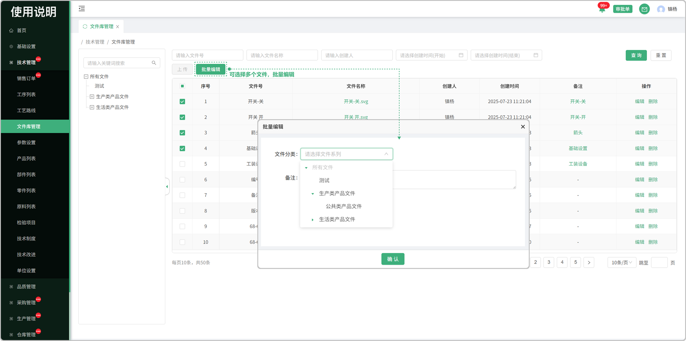

# 文件库管理

> 文件库管理列表位于技术管理板块，在文件库管理列表中可上传文件，支持删除、文件名称搜索等操作

#### 1.分类树

* 左侧展示文件分类树，点击可展开或收起
  * 点击“+”号，可添加系列或子系列
  * 当前系列下没有文件或子系列时，点击“x”号，可删除当前分类
  * 双击分类名称可对其进行编辑
  * 分类树边距可拖拽拉伸 

#### 2.编辑

* 点击文件编辑，可修改文件信息
  * 文件号
  * 文件分类
  * 备注

#### 3.删除

* 点击删除按键可对当前数据进行删除

#### 4.上传

* 选择左侧分类，上传文件，支持一个或多个文件进行上传
  * 上传文件方式有两种：
    * 1.点击文件上传区域，选择一个或者多个文件进行上传
    * 2.拖拽一个或多个文件进行上传
  * 文件上传成功后，系统根据文件名称生成文件号，可自行修改文件号
  * 备注编辑

#### 5.批量编辑

* 选择多个文件进行批量编辑
  * 文件分类
  * 备注

