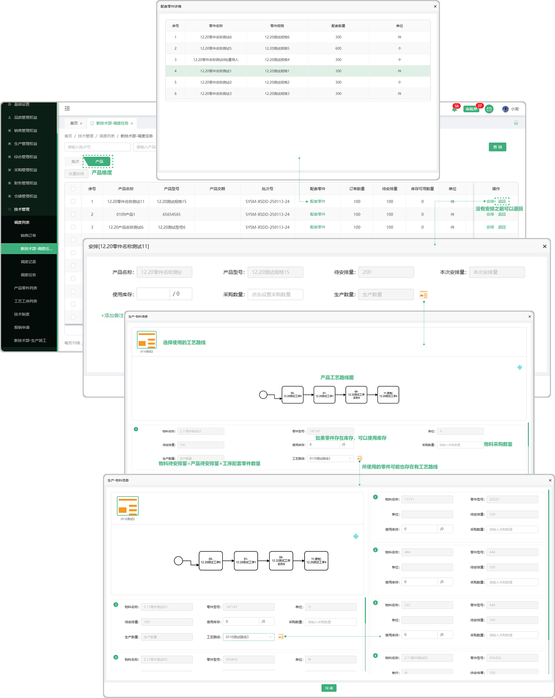

# 调度任务—产品

> 调度任务数据来源：销售订单完成排单后，调度任务列表根据销售订单生成对应的调度任务,目前分为批次维度和产品维度。

#### 1.产品维度安排

* 可通过批次号，产品名称，产品型号，产品交期进行数据筛选

* 退回功能：一个批次中的产品未进行过安排，可进行退回操作。(退回操作后数据返回到销售订单列表中，可重新进行排单)

* 当安排的产品有工艺路线时，可以通过库存，采购（包含采购成品和外协加工数量），生产方式进行调度安排

* 本次安排数量：使用库存数量+采购数量（采购成品+外协加工数量）+生产数量

* 待安排数量：订单数量-已安排数量

* 生产数量计算规则：以能满足生产的产品数量的最小配套零件进行计算

  -例如：A产品生产需要配套3个B产品，2个C产品，调度安排生产时，提供了9个B产品，4个C产品，则生产数量为2个

#### 2.采购安排-外协加工明细

* 没有使用工艺路线的产品，安排采购，使用外协加工时，可手动添加外发配套零件

#### 3.批量安排

* 安排：只支持相同产品的合并安排

* 库存：在安排中有库存的话可以使用库存来安排

* 采购数量:分为直接采购成品和外协加工
  
  -外协加工：有工艺路线的产品，安排采购使用外协加工时，可直接带出来所用的零件。没有使用工艺路线的产品，安排采购，使用外协加工时，可手动添加外发配套零件

* 生产数量：可点击工艺路线图标选择路线安排物料（可用库存或者采购），安排完成生产数量会自动带出

