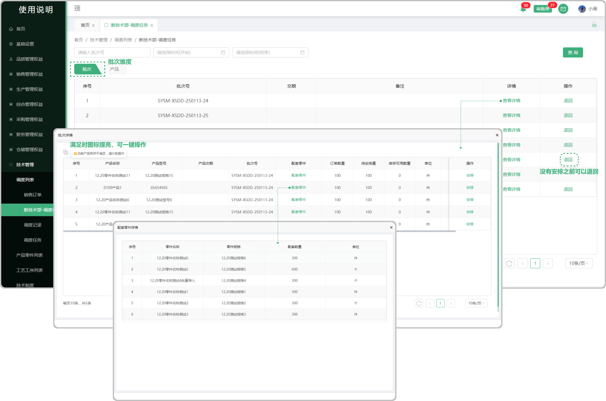
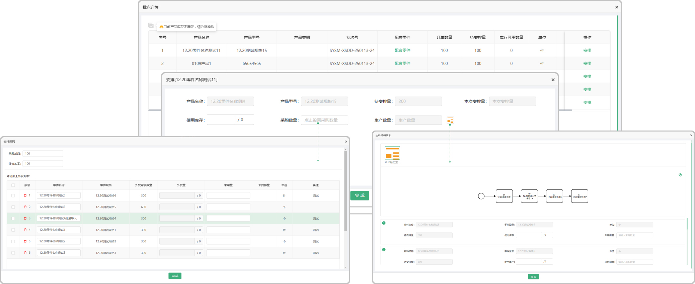

# 调度任务—批次

> 调度任务数据来源：销售订单完成排单后，调度任务列表根据销售订单生成对应的调度任务,目前分为批次维度和产品维度。

#### 1.批次
* 可通过批次号，和交期的时间维度进行筛选
* 退回：一个批次中的产品未进行过安排，可进行退回操作。(退回操作后数据返回到销售订单列表中，可重新进行排单)
* 批量安排：当前批次中所有产品，库存均可满足时，且产品未进行单次安排时，可以进行批量一键安排，（产品调度走库存）
* 配套零件：点击显示这个产品所需的配套零件

#### 2.批次维度安排

* 当安排的产品有工艺路线时，可以通过库存，采购（包含采购成品和外协加工数量），生产方式进行调度安排

* 当安排的产品没有工艺路线时，安排采购，使用外协加工时，可手动添加外发配套零件

* 本次安排数量：使用库存数量+采购数量（采购成品+外协加工数量）+生产数量

* 待安排数量：订单数量-已安排数量

