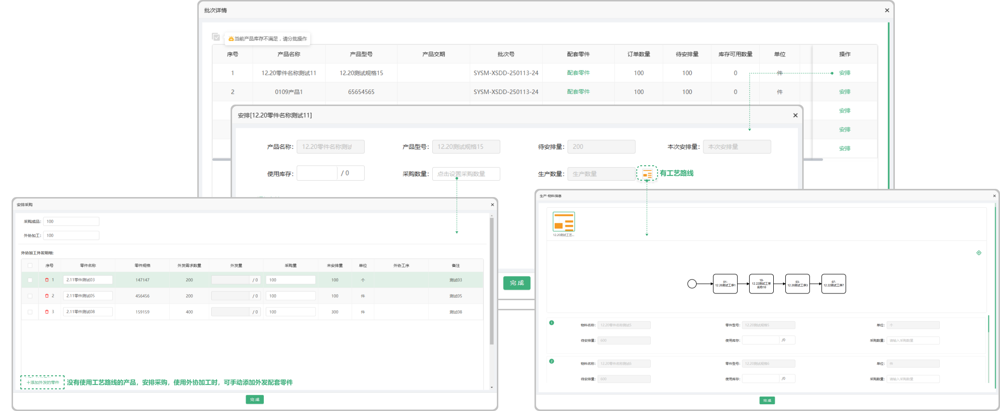

# 调度任务—批次

> "调度任务“分为：批次维度和产品维度，在批次维度中可进行产品和零件的安排，调度任务中的信息来源于是在销售订单中排单的产品、以及零件的信息流转到调度任务中，在批次中点击 ”查看详情“跳出弹窗可操作安排在个零件或产品，也可以点击操作中的 "退回"（退回：无需安排，退回至技术。已被安排的只有详情，

#### 1. 如图所示：零件
* 安排：点击安排，跳出弹窗在弹窗里面安排这个零件

#### 2. 如图所示：产品
* 安排：点击安排，跳出弹窗在弹窗里面安排这个产品

