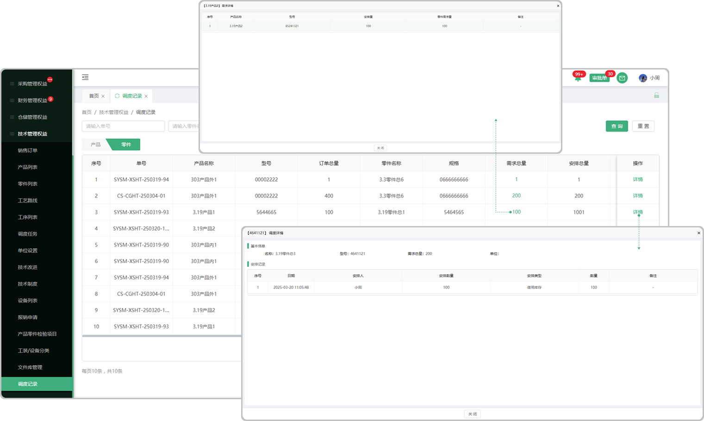

# 调度记录

> "调度记录“位于技术管理板块，调度生产安排记录，用来记录调度操作,一个是产品维度，一个是零件维度

#### 1. 产品维度

* 页面支持单号、产品名称、产品型号、安排类型的查看

* 详情界面可查看产品调度安排的详细数据

#### 2.零件维度

* 页面支持单号、零件名称、型号规格、安排类型的查看

* 详情界面可查看零件调度安排的详细数据

* 可点击查看需求总量的详细信息

