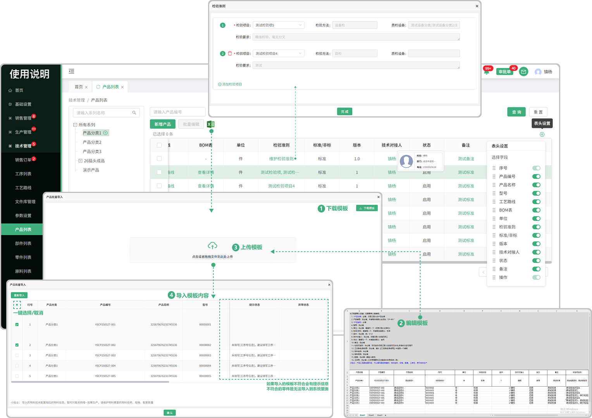
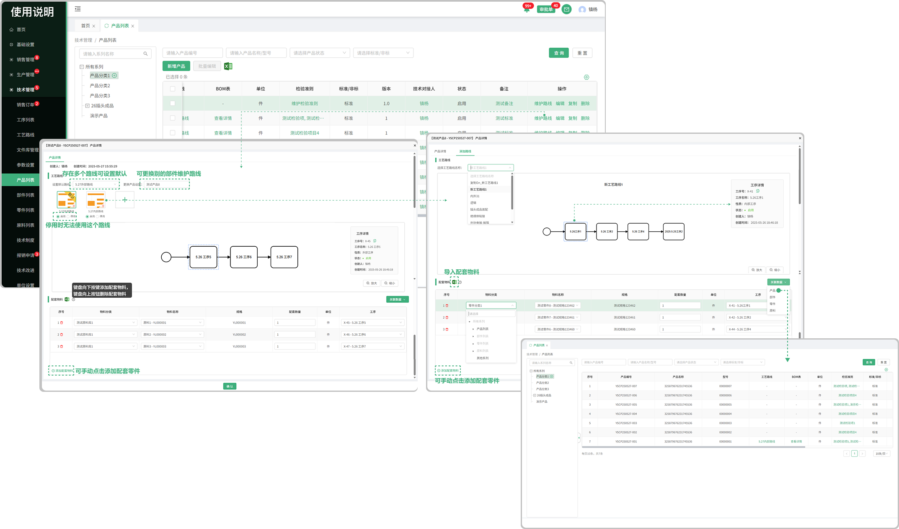
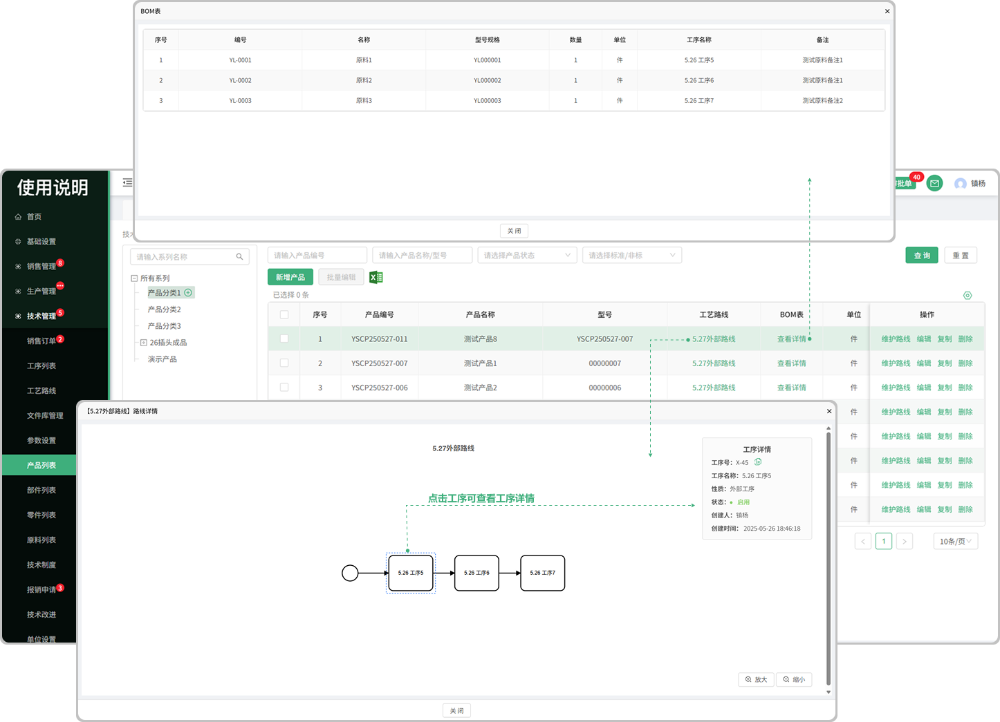

# 部件列表

> 部件列表位于技术管理板块，可添加部件系列，在系列中新增部件，新增的部件支持维护路线，复制，编辑，删除 等操作.

#### 1.新增/编辑部件系列
* 默认显示所有系列，鼠标悬浮在系列上面可点击＋新增系列

  -新增的系列可再加子系列，子系列也可以往下面延申

  -如果该系列下有部件数据，就无法删除，没有数据的 可删除

  -可双击系列名称更改名称或者调换系列位置（也可手动拖拽调整系列位置）

#### 2.新增部件
* 点击新增部件按钮添加部件

  -在新增部件之前需选择对应的系列（放置的位置）

  -新增的部件名称/规格可以重复

  -如果在创建部件时状态选择了停用，那这个部件就不可用

#### 3.编辑功能

* 可在原有新增的部件上进行编辑修改

#### 4.复制功能

* 可在这个部件的基础上去复制一个相同的部件出来，能够复制全部信息

#### 5.删除功能

* 可以通过删除按钮进行删除操作

* 已经进行合同签章的部件不允许进行删除

#### 6.批量编辑
* 先勾选需要批量编辑的部件才能触发批量编辑按钮（默认置灰，只有勾选以后才提亮）

* 可一键选择/取消

#### 7.批量导入部件

* 点击批量导入，先下载模板（注意下载的模板只适用于批量导入部件里面上传的模板)
* 点开下载的模板进行编辑（编辑时请阅读表格上面的提示文案，以防导入时出现错误，从而无法导入）

  -模板中的图纸号就是文件库管理列表中所保存的文件号

  -模板中的检验项目名称就是技术部检验项目列表中所添加的检验项

* 点击或者拖拽所保存的模板（只有在部件的批量导入中下载的模板才能上传，其他无效）进行上传
* 上传成功会弹出显示上传的数据，可选择性导入或者一键导入（如果无法导入，请滑动到页面最后，查看提示信息，可能存在编辑时出现的错误，需从新更改再次上传）

#### 8.维护检验准则

* 添加检验项目（支持添加多个检验项目）

  -检验项目来源于检验项目列表

  -鼠标悬浮在任意一个检验项目上面，出现删除的图标可删除

#### 9.技术对接人/备注

* 悬浮在对接人下方名称可查看这个人员的基本信息

* 点击备注信息可打开弹窗查看完整的备注信息

#### 10.表头设置

* 点击表头设置图标可更改表头字段的显示/隐藏

#### 11.维护路线

* 点击可添加工艺路线，支持设置默认路线，可在路线中直接更换别的部件去维护路线

* 启用/停用：停用时无法使用该路线，启用时可以使用该路线

* 已添加的工艺路线可点击路线标签中的删除图标进行删除

#### 12.配套物料

1.导入配套物料

* 点击图标，先下载模板（注意下载的模板只适用于部件配套物料里面上传的模板)
* 点开下载的模板进行编辑（编辑时请阅读表格上面的提示文案，以防导入时出现错误，从而无法导入）

* 点击或者拖拽所保存的模板（只有在部件配套物料导入中下载的模板才能上传，其他无效）进行上传

* 上传成功会弹出显示上传的数据，可选择性导入或者一键导入（如果无法导入，请滑动到页面最后，查看提示信息，可能存在编辑时出现的错误，需从新更改再次上传）

2.手动添加配套物料

* 点击添加配套物料按钮可新增配套物料，或使用快捷键（键盘向下按键添加配套物料，键盘向上按键删除配套物料）

* 添加的配套物料支持删除

* 选择物料的分类（产品，部件，零件，原料，其他)，物料名称(物料下拉列表会去除已停用的物料)，规格，配套数量，单位，工序号

#### 13.关联数据

* 添加查看产品，部件，零件，原料，工序，工艺路线的弹框，便于信息查看

#### 14.工艺路线

* 可查看这个产品所使用的工艺路线详情

#### 15.BOM表

* 点击查看这个产品下所用到的物料明细

