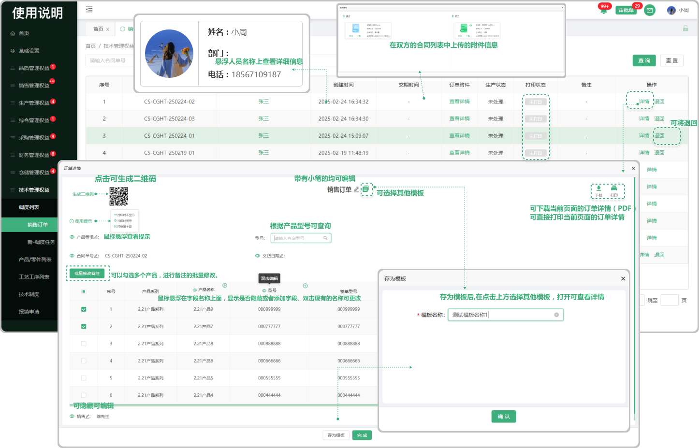
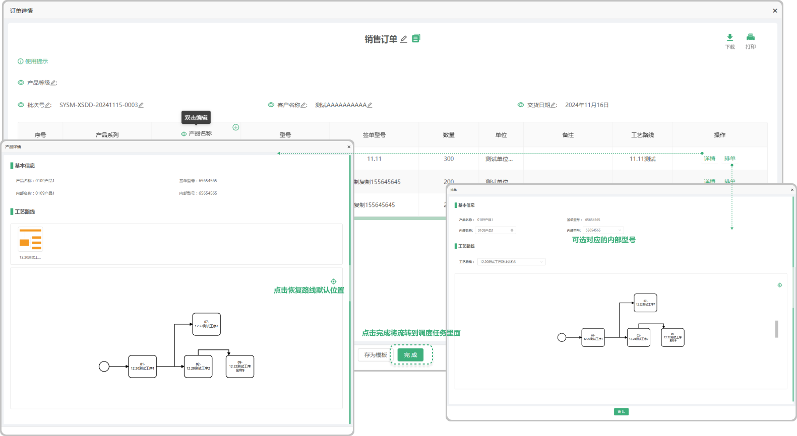

# 销售订单

> 销售订单列表位于技术管理板块，销售订单里面的内容是在合同列表签章完，点击开始生产以后带入过来的，未排单的销售订单可退回（退回至合同）, 销售订单列表中的产品，未设置内部型号时，技术部人员进行排单时，可以分批进行排单安排，未设置内部型号的产品不生成调度任务

#### 1. 页面功能

* 销售员：鼠标悬浮在销售员对应的员工下可显示员工的基本信息

* 订单附件：是指当时双方在合同列表签章时上传的附件，点击可预览，下载，PDF打印

* 打印：如果在详情里面点击打印以后页面会提示已打印标识告诉用户这个单子已经打印过了

* 生产状态：

  -未处理：没有排单的情况下显示 “未处理”

  -已处理：点击完排单以后，再次点击下方的完成显示 “已处理”

#### 2. 详情
* 表头名称支持修改（点击修改图标或双击文字可修改名称）
* 下载：可点击下载页面中的产品信息
* 打印：可点击打印页面中的产品信息
* 打印时间：可填写打印时间，在打印的时候显示（默认自动填写当天日期）
* 生成二维码：点击生成二维码文字，app端可扫码查看明细
* 型号查询：在销售订单详情页面，可根据产品型号进行查询
* 批量修改备注：在销售订单详情页面，可以勾选多个产品，进行备注的批量修改
* 备注：悬浮出现修改图标可添加或修改备注
* 宽度：鼠标悬浮在表头的间隔中可调整表格的宽度

### 3.退回功能

* 未排单之前可退回，已排单的情况下，不能退回，只能查看信息

  -退回至合同列表

#### 4. 详情、排单

* 生成二维码：点击文字可生成二维码

* 详情：点击详情跳转弹窗可进行查看这个产品的工艺线路以及添加工艺路线配套零件的展示

  -点击选中工艺路线中的工序，只展示工序下的配套零件信息，切右方出现工序详情
 
  -产品存在多个工艺路线，产品详情进行查看时，只展示排单时选择的工艺路线

* 排单：点击可排单，可查看添加工艺路线配套零件的展示，
   
  -销售订单进行产品排单时，如果选择了工艺路线，当查看产品详情时会展示工艺路线和工序的全部配套零件信息

  -如果没有工艺路线排单时，系统将提示:选择的内部型号暂未配置工艺路线

   -排单完成以后会流转到调度里面
 

