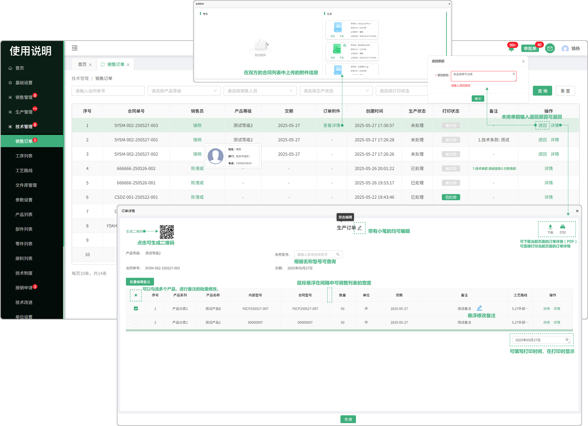
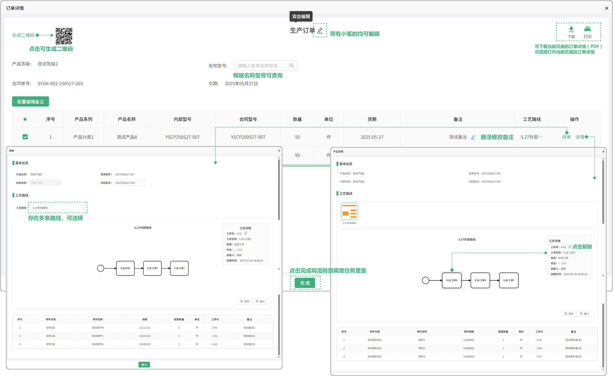

# 销售订单

> 销售订单列表位于技术管理板块，销售订单里面的内容是在合同列表签章完，点击开始生产以后带入过来的，未排单的销售订单可退回（退回至合同）, 销售订单列表中的产品，未设置内部型号时，技术部人员进行排单时，可以分批进行排单安排，未设置内部型号的产品不生成调度任务

#### 1. 页面功能

* 销售员：点击名称可查看销售人员的基本信息

* 订单附件：是指当时双方在合同列表签章时上传的附件，点击可预览，下载，PDF打印

* 打印状态：如果在详情里面点击打印以后页面会提示已打印标识告诉用户这个单子已经打印过了

* 生产状态：

  -未处理：没有排单的情况下显示 “未处理”

  -已处理：点击完排单以后，再次点击下方的完成显示 “已处理”

### 2.退回功能

* 未排单之前可退回，已排单的情况下，不能退回，只能查看信息

  -退回至合同列表

#### 3. 详情

* 点击编辑名称按钮可编辑订单名称
* 点击生成二维码按钮可生成订单二维码
* 点击下载按钮可下载pdf订单文件
* 点击打印按钮可在弹窗中打印相应的文件
* 先勾选序号前的勾选框，在点击批量修改备注按钮可一键修改备注

  -也可点击列表中的备注字段单一修改

#### 4. 排单

* 排单：点击可排单，可查看添加工艺路线配套零件的展示

    -点击选中工艺路线中的工序，只展示工序下的配套零件信息，切右方出现工序详情

  -产品存在多个工艺路线，产品详情进行查看时，只展示排单时选择的工艺路线

   -销售订单进行产品排单时，如果选择了工艺路线，当查看产品详情时会展示工艺路线和工序的全部配套零件信息

   -如果没有工艺路线排单时，系统将提示:选择的内部型号暂未配置工艺路线

   -协作版本排完单直接生产

   -有路线版本的排单完成以后会流转到调度里面
 

