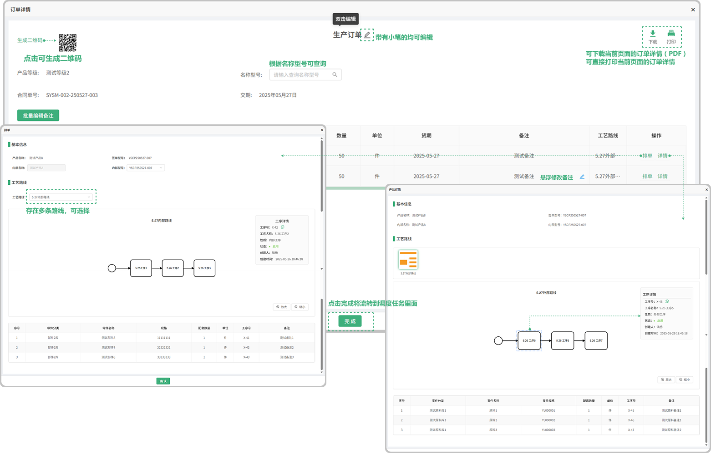

# 销售订单

> 销售订单列表位于技术部板块，销售订单里面的内容是在合同列表签章完开始生产以后带入过来的，在销售订单中可以去对某一个批次号下面的产品进行排单或者退回，状态分为：处理中、未处理、已处理

#### 1. 如图所示：

* 销售员：鼠标悬浮在销售员对应的员工下面可显示员工的基本信息
* 订单附件：是指当时双方在合同列表签章时上传的附件，点击可查看、可下载
* 退回：可退回，但是在已处理完的情况下，不能退回，只能查看信息
* 未处理：没有排单的情况下显示未处理
* 处理中：点击排单以后显示 “处理中”
* 已处理：点击完排单以后，再次点击下方的完成显示 “已处理”
* 下载：可点击下载页面中的产品信息

* 详情：点击详情跳转弹窗可进行查看这个产品的工艺线路和排单 
* 完成：点击完成将流转到调度任务里面

