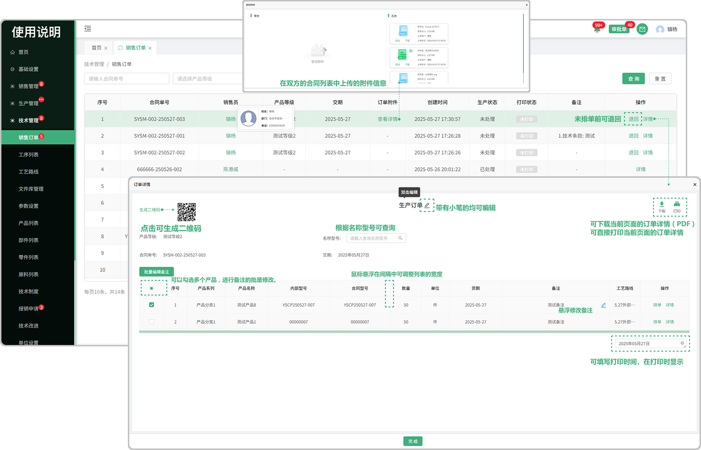

# 销售订单

> 销售订单列表位于技术部板块，销售订单里面的内容是在合同列表签章完开始生产以后带入过来的，在销售订单中可以去对某一个批次号下面的产品进行排单或者退回，状态分为：处理中、未处理、已处理（由于批次号、合同单号过长，所以展示不完整，鼠标可悬浮下方对应的批次号或者合同单号以便复制）在点击详情页面中带有小笔图标的信息均可编辑，可选择（显示或隐藏图标）在打印是是否展示页面所属的信息

#### 1. 页面功能

* 销售员：鼠标悬浮在销售员对应的员工下面可显示员工的基本信息

* 订单附件：是指当时双方在合同列表签章时上传的附件，点击可查看、可下载

* 打印：如果在详情里面点击打印以后页面会提示已打印标识告诉用户这个单子已经打印过了

* 生产状态：

  -未处理：没有排单的情况下显示 “未处理”

  -处理中：点击排单以后显示 “处理中”

  -已处理：点击完排单以后，再次点击下方的完成显示 “已处理”

#### 2. 详情

* 下载：可点击下载页面中的产品信息
* 打印：可点击打印页面中的产品信息
* 选择模板：在销售订单标题名称后面有选择模板的图标，点击图标可选择其他的模板（模板来源于当时存储的模板）
* 存为模板：点击可把当前页面信息存储为模板，用于选择模板时更换
* 隐藏 / 显示：在页面中有隐藏/ 显示的图标， 用于打印时是否显示页面的信息，可根据页面中使用提示查看（显示图标代表打印时可以看到，隐藏图标代表打印是不可以看到，同时可新增字段（鼠标悬浮在表格字段上方所对应名称上面会显示 隐藏、显示、新增的图标））

#### 3.退回功能

* 可退回，但是在已处理完的情况下，不能退回，只能查看信息

#### 4. 详情、排单

* 详情：点击详情跳转弹窗可进行查看这个产品的工艺线路和排单 

* 排单：点击可安排排单，可选择系统中相对应的型号
   
   -排单完成以后会流转到调度里面

