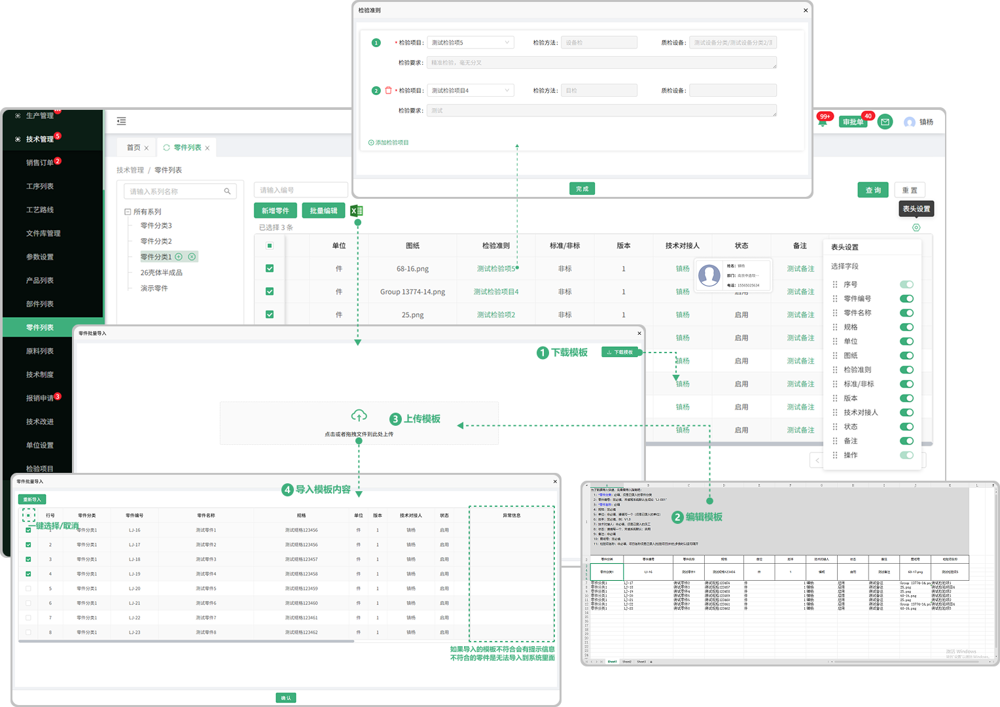
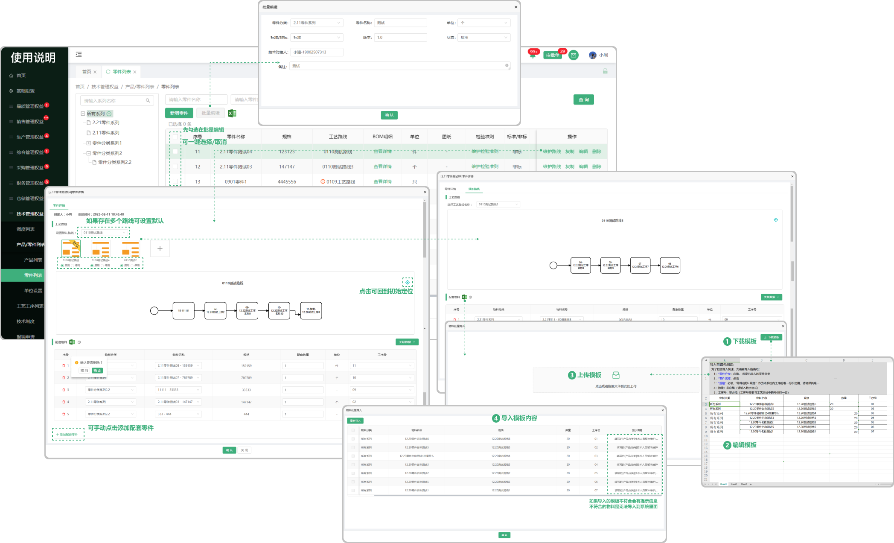

# 零件列表

> 零件列表位于技术部板块是添加零件系列和新增零件的页面，可以新增零件、批量导入、查看详情、复制、编辑、修改等操作.首先要去单位配置列表:添加"单位"才能添加零件 
* 零件系列：在页面中可以添加零件的系列，系列也可以增加他的子级系列，（注意：当这个系列上面已经新增了零件就 ”不可以“ 添加子系列）
*  添加零件：在页面中可以添加零件的信息，批量导入、支持查看、复制、编辑、修改

#### 1. 如图所示：
* 当前页面可以新增系列（注意：”当这个系列上面已经新增了零件就 ”不可以“ 添加子系列“），在系列中新增零件、以及批量导入。
* 新增零件（在选中某一个零件系列中去进行添加零件）
* 复制（在这个零件基础上复制一个相同的产品）
* 修改（在这个零件基础上修改它原有的零件信息）
* 维护检验准则（去维护这个零件的检验准则，里面的”检验项目“：来源于技术部列表中添加的检验）
* 查看文件 （文件来源于新增零件里面上传的文件）

#### 2. 如图所示：
* 批量导入（首先进去”下载模板“，在桌面端编辑保存以后，点击或拖拽上传，上传以后如果无法”勾选“，请右滑到最后查看提示的错误信息，修改以后在进行上传文件）

#### 3. 如图所示：
* 编辑（编辑是指在这个零件中去编制他的工艺路线）：点开以后会有新增工艺路线（新增一个新的路线，从零开始搭建工序-零件）、复制路线（复制之前所编辑的工艺路线）、修改路线（保存草稿的路线）
* 修改路线（来源于当时工艺路线 ”保存草稿箱“ ）

#### 4. 如图所示：
* 选中一个需要修改的路线， "点击" 修改按钮进行修改路线
* 在创建工艺路线的时候可以新增零件（来源于技术部列表在创建的零件以及零件的路线）
* 在创建工艺路线的时候可以添加质检项（来源于技术部列表中检验项目新增的检验项）

#### 5. 如图所示：
* 零件列表—详情中展示如下，可点击零件的检验项和零件，来切换展示它的  ”工序检验项" 和" 路线配套零件“
* 路线的变更记录（来源于页面编辑中修改的变动）
* 产品的变更记录（来源于页面中修改产品信息备注带来的信息

