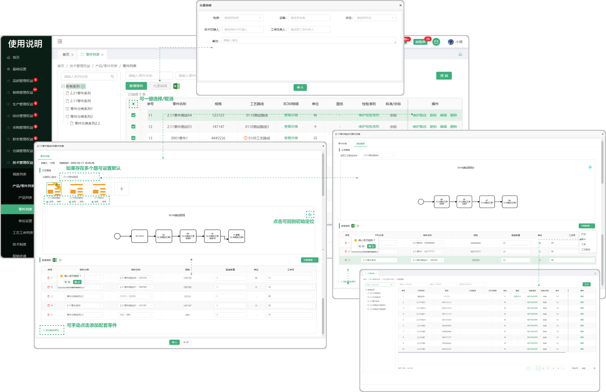

# 零件列表

> 零件列表位于技术部板块，可添加零件系列、可以新增零件、批量导入、复制、编辑、等操作.

#### 1.新增/编辑零件系列
* 默认显示所有系列，鼠标悬浮在系列上面可点击＋新增系列

  -新增的系列可再加子系列，子系列也可以往下面延申

  -如果该分类下有分类数据，就无法删除，分类下没有数据的 可删除

  -可双击系列名称更改名称或者调换系列位置（也可手动拖拽调整系列位置）

#### 2.新增零件
* 点击新增零件按钮添加零件

   -在新增零件之前需选择对应的系列（放置的位置）

   -新增的零件名称可以重复，零件规格不可以重复

   -如果在创建零件时状态选择了停用，那么这个零件就不可用

#### 3.编辑功能/复制功能
* 可编辑之前所创建的零件

  -编辑弹窗里面会记录着创建这个零件的创建人和创建时间

  -批量编辑时，只修改填写的内容，未填写的保持原值

* 可在这个零件的基础上去复制一个相同的零件出来

#### 4.维护检验准则
* 添加检验项目（支持添加多个检验项目）
  -检验项目来源于零件/产品检验项目列表
  -鼠标悬浮在任意一个检验项目上面，出现删除的图标可删

#### 5.批量导入零件

* 1.点击批量导入，先下载模板（注意下载的模板只适用于批量导入零件里面上传的模板)
* 2.点开下载的模板进行编辑（编辑时请阅读表格上面的提示文案，以防导入时出现错误，从而无法导入）
* 3.点击或者拖拽所保存的模板（只有在零件的批量导入中下载的模板才能上传，其他无效）进行上传
* 4.上传成功会弹出显示上传的数据，可选择性导入或者一键导入（如果无法导入，请滑动到页面最后，查看提示信息，可能存在编辑时出现的错误，需从新更改再次上传）

#### 6.批量编辑
* 先勾选需要批量编辑的零件才能触发批量编辑按钮（默认置灰，只有勾选以后才提亮）
* 可一键选择/取消

#### 6.零件详情
* 默认路线

 -如果出现多条工艺路线时可在下拉框中设置一条默认的工艺路线

* 启用/停用功能

  -启用:代表可以使用这条工艺路线

  -停用：相当于关闭，不可使用这条工艺路线

  -启用和停用只会在当前这个零件下起到作用，不会影响其他零件下面绑定的工艺路线状态和生产使用中的工艺路线状态

  -在改变启用停用同时需要判断这条工艺路线总状态是否被停用（工艺路线管理列表中的状态），如果总状态被停用了，零件详情中进行启用操作，提示“工艺路线已经被停用啦，请到工艺路线启用

  -零件的工艺路线停用后，调度在进行生产和委外加工时，不再能够选择到已停用的工艺路线进行后续任务安排

  -工艺路线的启停不影响已进行生产安排的零件，例如停用前使用该工艺路线已进行生产安排的零件，正常按照工艺路线进行流程数据流转

#### 7.零件详情中新增工艺路线

* 点击+号添加工艺路线，新增的工艺路线需要导入配套物料

* 批量导入配套物料

  -点击批量导入，先下载模板（注意下载的模板只适用于批量导入零件详情里面新增工艺路线时上传的配套物料模板)

 -点开下载的模板进行编辑（编辑时请阅读表格上面的提示文案，以防导入时出现错误，从而无法导入）

 -点击或者拖拽所保存的模板（只有在零件详情新增工艺路线批量导入配套物料中下载的模板才能上传，其他无效）进行上传

 -上传成功会弹出显示上传的数据，可选择性导入或者一键导入（如果无法导入，请滑动到页面最后，查看提示信息，可能存在编辑时出现的错误，需从新更改再次上传）
 
 -上传完成返回可查看上传的物料（点击相对应的工序可查看下方所挂的物料）

#### 8.手动添加配套零件

* 添加配套零件：点击添加配套零件(支持删除)

  -选择零件的分类、零件名称(零件下拉列表会去除已停用的零件)、零件规格、配套数量、工序号

#### 9.关联数据

* 添加查看产品，零件，工序，工艺路线的弹框，便于信息查看

