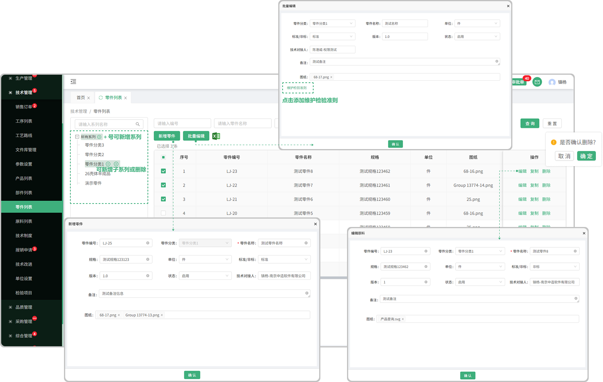

# 零件列表

> 零件列表位于技术管理板块，可添加零件系列、在系列中新增零件、批量导入、复制、编辑、删除 等操作.

#### 1.新增/编辑零件系列
* 默认显示所有系列，鼠标悬浮在系列上面可点击＋新增系列

  -新增的系列可再加子系列，子系列也可以往下面延申

  -如果该系列下有零件数据，就无法删除，没有数据的 可删除

  -可双击系列名称更改名称或者调换系列位置（也可手动拖拽调整系列位置）

#### 2.新增零件
* 点击新增零件按钮添加零件

   -在新增零件之前需选择对应的系列（放置的位置）

   -新增的零件名称/零件规格可以重复

   -如果在创建零件时状态选择了停用，那这个零件就不可用

#### 3.编辑功能

* 可在原有新增的零件上进行编辑修改

#### 4.复制功能

* 可在这个零件的基础上去复制一个相同的零件出来，能够复制全部信息

#### 5.删除功能

* 可以通过删除按钮进行删除操作

* 已经进行合同签章的零件不允许进行删除

#### 6.批量编辑
* 先勾选需要批量编辑的零件才能触发批量编辑按钮（默认置灰，只有勾选以后才提亮）

* 可一键选择/取消

#### 7.批量导入零件

* 点击批量导入，先下载模板（注意下载的模板只适用于批量导入零件里面上传的模板)
* 点开下载的模板进行编辑（编辑时请阅读表格上面的提示文案，以防导入时出现错误，从而无法导入）

  -模板中的图纸号就是文件库管理列表中所保存的文件号

  -模板中的检验项目名称就是技术部检验项目列表中所添加的检验项

* 点击或者拖拽所保存的模板（只有在零件的批量导入中下载的模板才能上传，其他无效）进行上传
* 上传成功会弹出显示上传的数据，可选择性导入或者一键导入（如果无法导入，请滑动到页面最后，查看提示信息，可能存在编辑时出现的错误，需从新更改再次上传）

#### 8.维护检验准则

* 添加检验项目（支持添加多个检验项目）

  -检验项目来源于检验项目列表
  
  -鼠标悬浮在任意一个检验项目上面，出现删除的图标可删除

#### 9.技术对接人/备注

* 悬浮在对接人下方名称可查看这个人员的基本信息

* 点击备注信息可打开弹窗查看完整的备注信息

#### 10.表头设置

* 点击表头设置图标可更改表头字段的显示/隐藏

