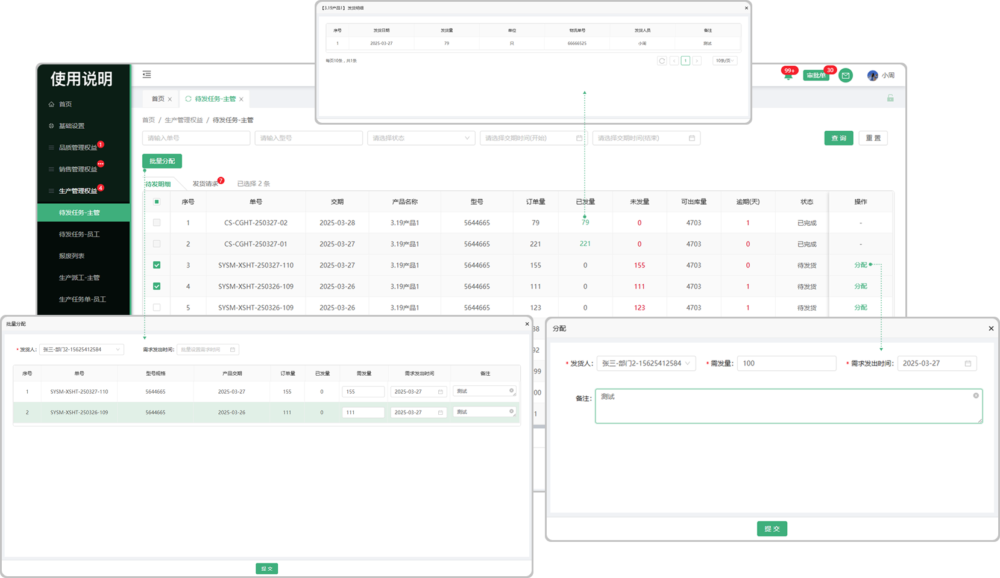
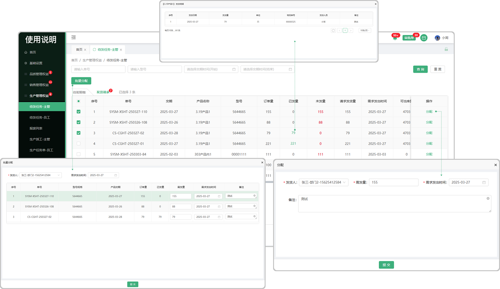

# 待发任务-主管
> “待发任务-主管”位于“生产管理板块”包含待发明细、发货请求，来源：由销售合同列表的发货流转而来

#### 1.待发明细来

* 销售合同签章完成点击开始生产，系统会触发待发任务，在待发任务中产生待发明细

#### 2.分配

* 在待发任务-主管列表中，只有主管可以分配

* 主管将待发明细中需要发货的单子点击分配给员工，在待发任务-员工列表中，分配的员工会接收到所分配的单子

#### 3.批量分配

* 勾选序号前的勾选框，触发批量分配按钮，点击批量分配按钮可将所勾选的单子分配给员工

#### 4.已发量

* 主管分配单子给员工，员工发货完成提交以后，主管在已发量中可点击查看到员工发货的信息

# 待发任务-发货请求

#### 1.发货请求来源

* 在销售合同页面点击发货，所发货的单子会流转到待发任务-发货请求这个页面

* 发货请求页面所带气泡提示，提示用户有多少单子未发货
* 

#### 2.分配

* 在待发任务-发货请求中，只有主管可以分配

* 主管将待发请求中需要发货的单子点击分配给员工，在待发任务-员工列表中，分配的员工会接收到所分配的单子

#### 3.批量分配

* 勾选序号前的勾选框，触发批量分配按钮，点击批量分配按钮可将所勾选的单子分配给员工

#### 4.已发量

* 主管分配单子给员工，员工发货完成提交以后，主管在已发量中可点击查看到员工发货的信息

