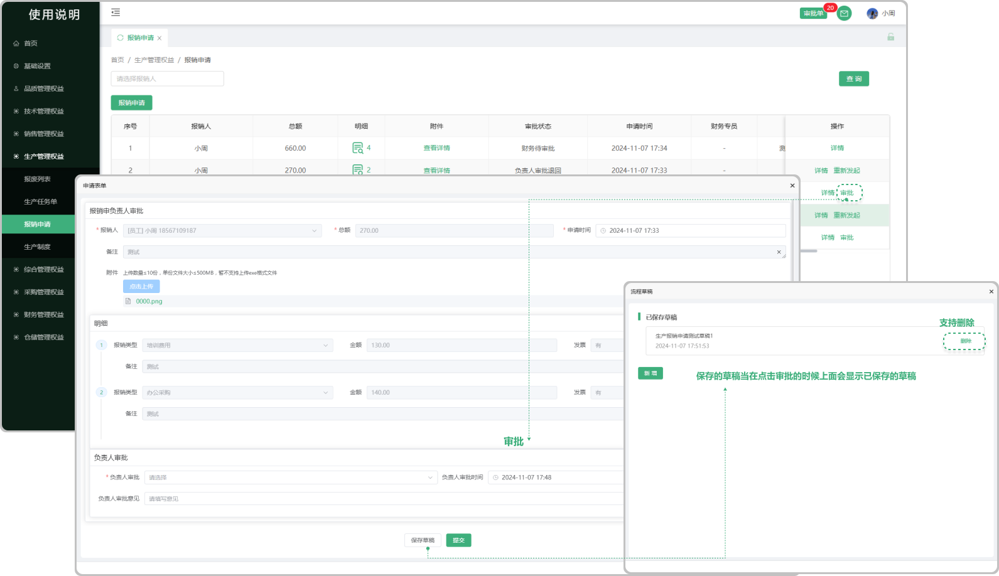

# 待发任务-主管

> “待发任务-主管”位于“生产管理板块”包含待发明细、发货请求

#### 1.待发明细来源

* 销售合同签章完成点击开始生产，系统会触发待发任务，在待发任务中产生待发明细

#### 2.分配

* 在待发任务-主管列表中，只有主管可以分配

* 主任将待发明细中需要发货的单子点击分配选择员工、需发量、需求发出时间给员工，在待发任务-员工列表中，分配的员工会接收到所分配的单子

#### 3.批量分配

* 勾选序号前的勾选框，触发批量分配按钮，点击批量分配按钮可将所勾选的单子分配给员工

