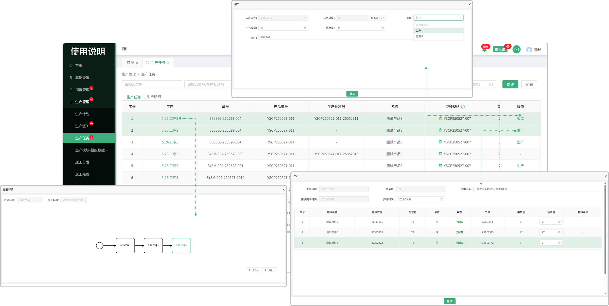
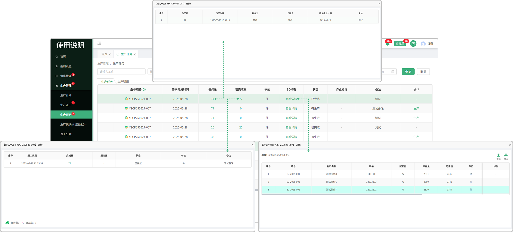
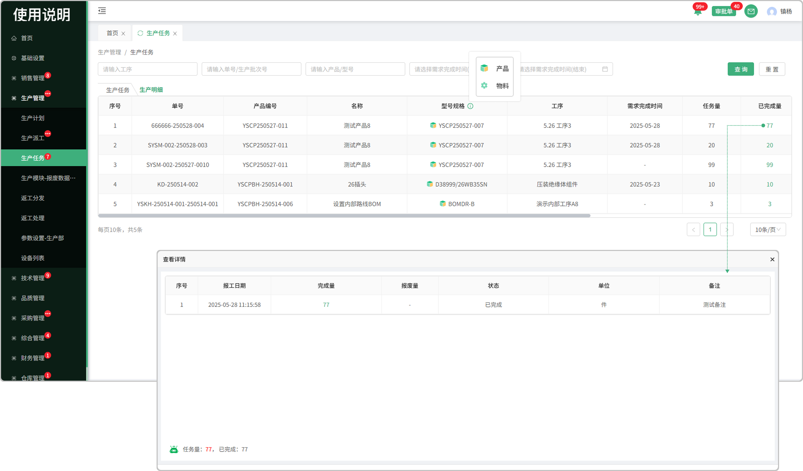

# 生产任务

> “生产任务”位于“生产管理板块” 生产任务中的任务单是从生产派工中派工而来，可在生产任务中生产，生产完成可报工

### 生产任务

#### 1.工序

* 点开工序，有颜色的框代表查看的是当前这道工序

#### 2.型号规格

* 产品和物料的区分，有图标提示

#### 4.报工

* 点击报工，输入完成量，报废量，备注，选择状态，完成报工

#### 5.生产

* 选择设备、开始时间，填写领取量

  -所领料的明细会带到出库列表-出库明细页面的领料情况中显示

#### 6.BOM

* 点击BOM表，可以查看工序对应的配套零件

 

### 6.任务量

* 点击可查看分发的任务量（分发量、分发时间、分发人员，操作人员、完成时间）

#### 7.已完成量

* 点击完成量，可以查看该工序的报工明细记录

# 生产明细

#### 1.型号规格

* 产品和物料的区分，有图标提示

#### 2.已完成量

* 点击完成量，可以查看该工序的报工明细记录

#### 3.逾期

* 超出填写的完成时间会显示逾期天数

