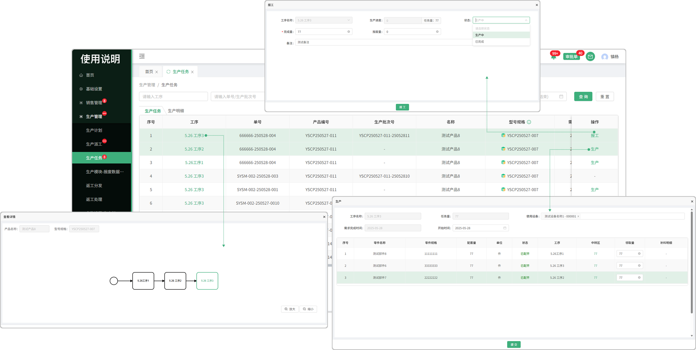
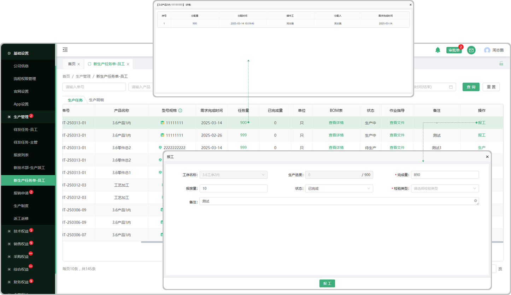
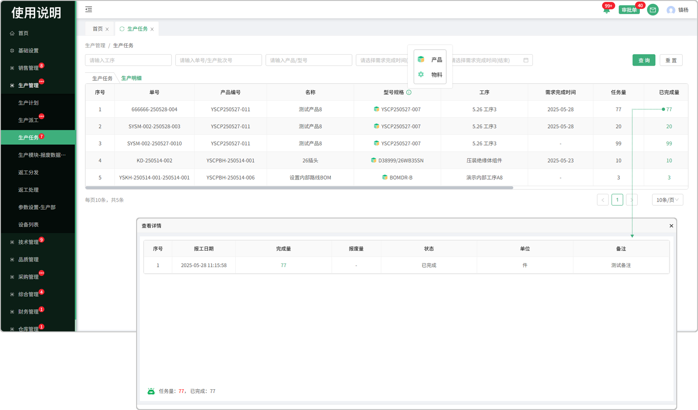

# 生产任务单-员工

> “生产任务单-员工”位于“生产管理板块” 生产任务(车间主任（部门负责人）分派任务选择的操作工会接收到对应的生产任务）、 生产明细

### 生产任务

#### 1.工序

* 点开工序，有颜色的框代表查看的是当前这道工序

* 产品工序和零件工序的区分：零件工序前面有图标

#### 2.BOM

* 点击BOM表，可以查看工序对应的配套零件

#### 3.作业指导

* 点击查看所上传的作业指导预览、下载、支持pdf打印

#### 4.生产

* 点击生产，确认是否开始生产

#### 5.报工

* 点击报工，输入接收量、完成量、报废量、状态、报工时间、下道工序、接收人员，完成报工

### 生产明细

#### 1.工序

* 点开工序，有颜色的框代表查看的是当前这道工序

* 产品工序和零件工序的区分：零件工序前面有图标

#### 2.已完成量

* 点击完成量，可以查看该工序的报工明细记录

* 存在一个产品/零件分配给多名人员来完成

#### 3.BOM

* 点击BOM表，可以查看工序对应的配套零件

