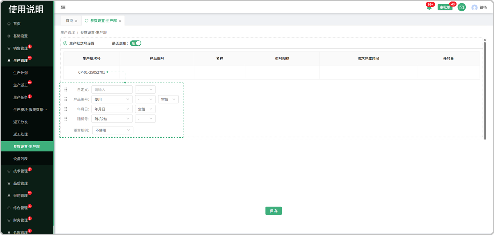
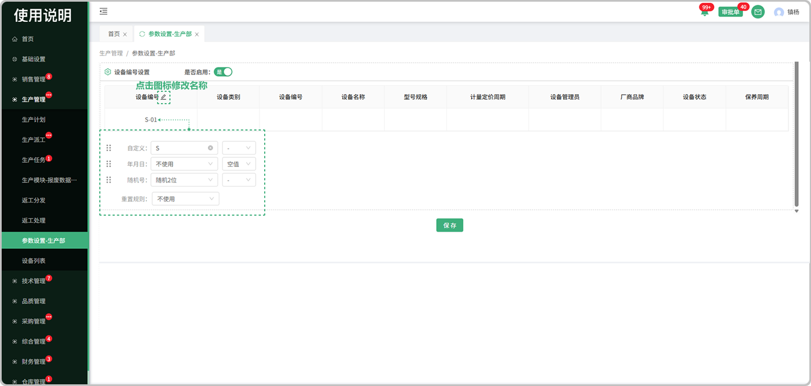

# 生产参数设置

> "参数设置"位于生产管理板块，可在参数设置中维护生产批次号，设备编号

#### 1. 生产批次号

* 是否启用：是代表使用，否代表不使用

* 预览：所设置的生产批次号可在表头中预览

* 批次号设置：分为自定义，产品编号，年月日，随机号，同时可选择符号带入

* 重置规则：分为日，月，年，不使用，列：选择了日，就代表一日后重置，年就是一年，不使用就是永久

#### 2. 设备编号

* 是否启用：是代表使用，否代表不使用

* 编号名称：点击修改图标可修改设备编号名称   

* 预览：所设置的部件编号可在表头中预览

* 设备编号设置：分为自定义，年月日，随机号，同时可选择符号带入

* 重置规则：分为日，月，年，不使用，列：选择了日，就代表一日后重置，年就是一年，不使用就是永久

