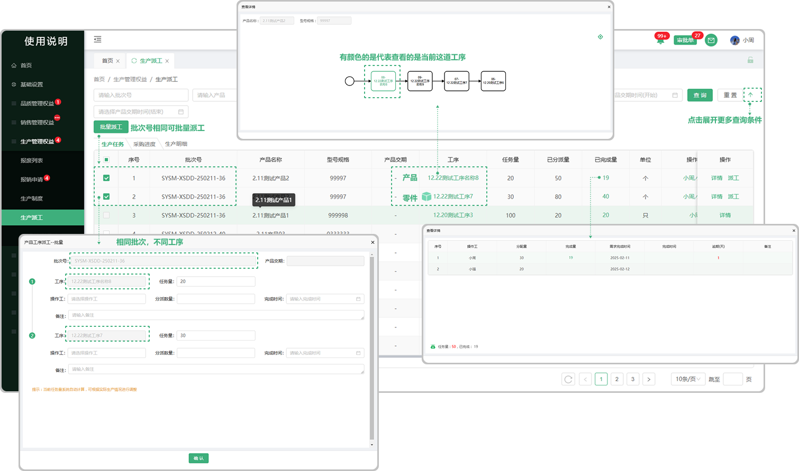
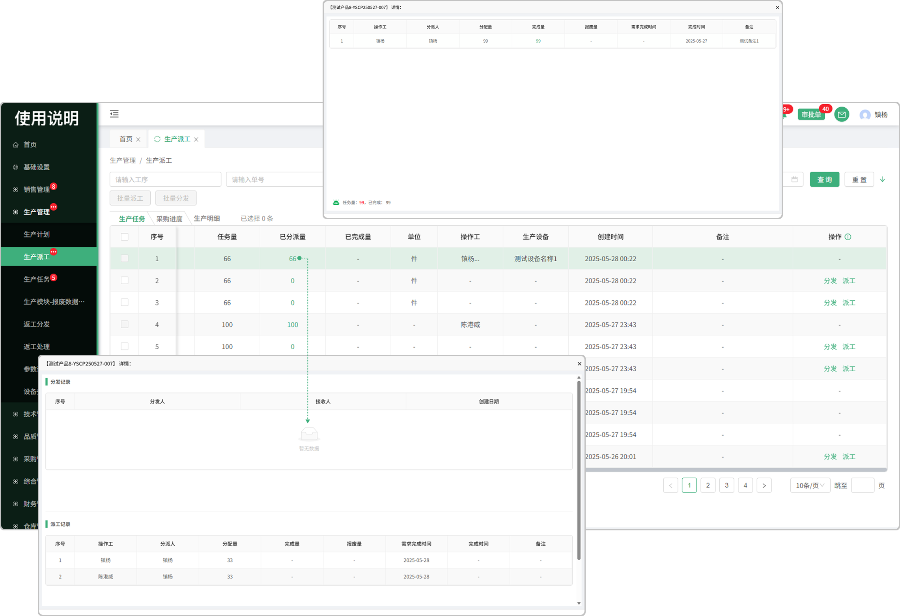
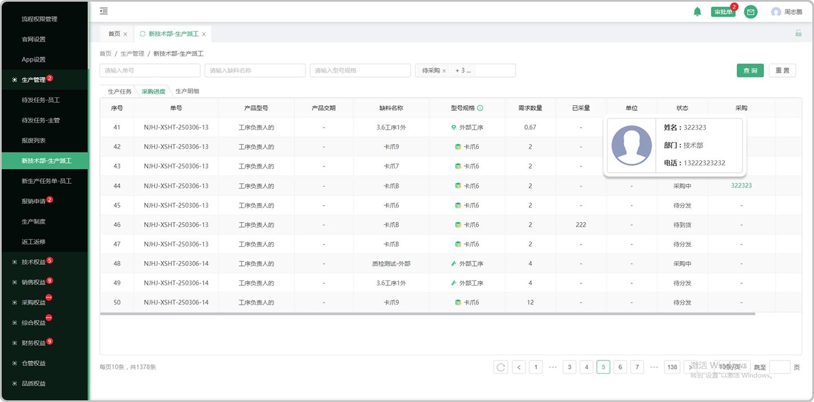
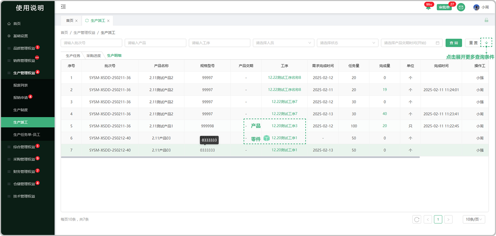

# 生产派工

> “生产派工列表”位于“生产管理板块” ，分为生产任务、采购进度、生产明细 

### 产任务

> 调度对有工艺路线的产品和零件进行生产安排，安排完成后，工艺路线中的 "内部工序" 生成生产任务

#### 1.任务查询

* 支持批次号，产品名称，工序名称，操作工，任务状态，产品交期搜索

#### 2.批量派工

* 车间主任（部门负责人）同一个批次下的多个生产任务可以进行批量派工操作，一个工序可以设置多个操作工

#### 3.工序

* 点开工序，有颜色的框代表查看的是当前这道工序

* 产品工序和零件工序的区分：零件工序前面有图标

#### 4.已完成量

* 点击完成量，可以查看该工序的报工明细记录

* 存在一个产品/零件分配给多名人员来完成

#### 5.操作工

* 点击查看分配的操作工人员

#### 6.BOM表

* 点击BOM表，可以查看工序对应的配套零件

#### 7.作业指导

* 点击查看所上传的作业指导预览、下载、支持pdf打印

#### 8.详情

* 点击查看这个产品/零件的详细内容

#### 9.报工

* 一个批次下可以设置多个操作工

*  设置多个操作工时，进行分派数量设置时，分派详情界面可以同时对选择的操作工设置分派数量

* 报工界面可自主填写完成数量

* 接收量为前道工序报工的完成数量

* 接收人员范围:下道工序的生产人员

* 状态设置为生产中时，即使完成量超出任务量，还可以进行报工操作

* 状态设置为已完成时，即使完成量小于任务量，生产任务状态也会更新为完成

*  系统能根据工艺路线，将报工信息触发至下道工序操作人员

### 采购进度

> 调度对有外部工序工艺路线的产品和零件进行生产安排，安排完成后，采购缺料列表会生成对应的询价单，同时生产派工的采购进度页面会显示对应的任务进度

#### 1.采购进度列表查询

* 可通过批次号，产品名称，工序名称，采购，状态，产品交期时间进行筛选

### 生产明细

> 车间主任-生产明细：已完成，生产中，已派工的生产任务

#### 1.生产明细列表查询

* 批次号，产品名称，工序名称，操作工，任务状态，产品交期

