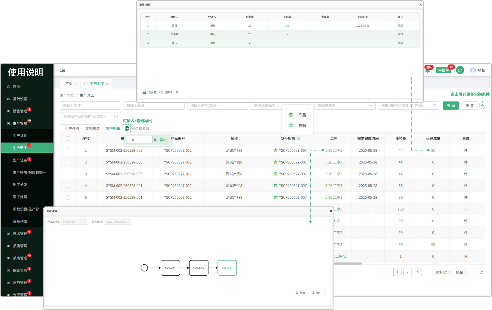

# 生产派工

> “生产派工列表”位于“生产管理板块” ，分为生产任务、采购进度、生产明细 

### 生产任务

> 调度对有工艺路线的产品和零件进行生产安排，安排完成后，工艺路线中的 "内部工序" 生成生产任务

#### 1.任务查询

* 支持单号、产品名称、i型号、工序名称、操作工、任务状态、产品交期搜索

#### 2.批量派工

* 车间主任（部门负责人）同一个批次下的多个生产任务可以进行批量派工操作，一个工序可以设置多个操作工

#### 3.工序

* 点开工序，有颜色的框代表查看的是当前这道工序

#### 4.型号规格

* 产品和零级的区分

  -产品零件带有区分图标

#### 5.已完成量

* 点击完成量，可以查看该工序的报工明细记录

* 存在一个产品/零件分配给多名人员来完成

#### 6.操作工

* 点击查看分配的操作工人员

#### 7.BOM表

* 点击BOM表，可以查看工序对应的配套零件

#### 8.派工

* 一个批次下可以设置多个操作工

*  设置多个操作工时，进行分派数量设置时，分派详情界面可以同时对选择的操作工设置分派数量

# 采购进度

> 调度对有外部工序工艺路线的产品和零件进行生产安排，安排完成后，采购缺料列表会生成对应的询价单，同时生产派工的采购进度页面会显示对应的任务进度

#### 1.采购进度列表查询

* 可通过单号、缺料名称、工序名称、型号、状态、进行筛选

#### 2.采购员

* 点击采购人员可查看采购人员的基本信息

# 生产明细

> 车间主任-生产明细：已完成，生产中，已派工的生产任务

#### 1.生产明细列表查询

* 可通过单号、工序名称、产品名称、型号、人员、状态，时间、进行筛选

#### 2.工序

* 点开工序，有颜色的框代表查看的是当前这道工序

#### 3.已完成量

* 点击完成量，可以查看该工序的报工明细记录

