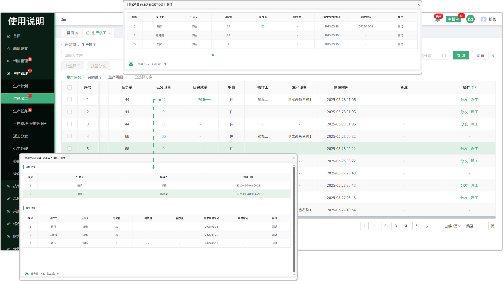
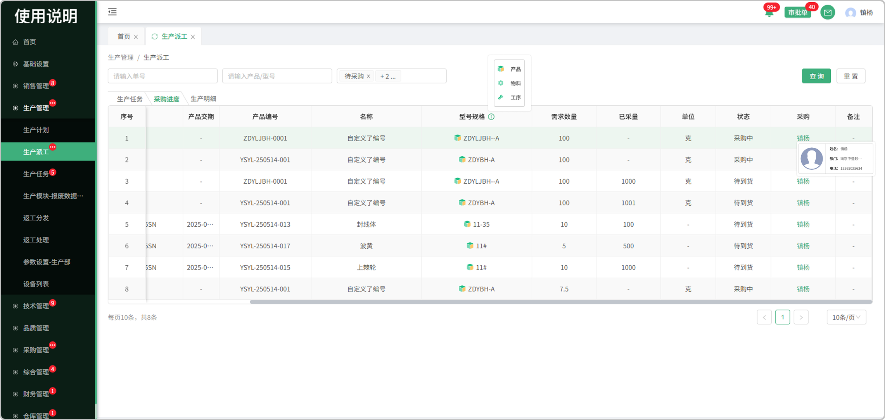

# 生产派工

> “生产派工列表”位于“生产管理板块” ，分为生产任务、采购进度、生产明细 

### 生产任务

> 生产安排对有工艺路线的产品和物料进行生产安排，安排完成后，工艺路线中的 "内部工序" 生成生产任务

#### 1.任务查询

* 支持单号、产品型号、工序、操作工、状态、产品交期搜索（可点击图标展示更多查询条件）

#### 2.批量派工

* 先勾选需要批量派工的产品才能触发批量派工按钮（默认置灰，只有勾选以后才提亮）
* 可一键选择/取消
* 单号与工序均不一致，不能批量派工
* 可将任务批量派给多个人，可设置多个操作工
* 设置操作工时可点击图标查看当前操作工进行中的任务详情

#### 3.批量分发

* 先勾选需要批量分发的产品才能触发批量分发按钮（默认置灰，只有勾选以后才提亮）
* 可一键选择/取消

#### 4.分发

* 将任务分发至组长

#### 5.型号规格

* 鼠标悬浮字段 旁的小图标可查看产品/物料区分，区分以图标的形式展现出来

#### 6.工序

* 点开工序可查看详情，有颜色的框代表查看的是当前这道工序

#### 7.BOM表

* 点击BOM表详情，可以查看工序对应的物料，有颜色的的代表对应工序所用到的物料
* 可下载，打印

#### 8.派工

* 一次性完成派工后，派工按钮和分发按钮不显示（如果需分发请在派工完成之前分发完成）

* 可添加多个操作工（支持删除）

* 可将任务量分配给多个操作工

* 可点击图标查看当前操作工进行中的任务详情

#### 9.已分派量

* 点击可查看分发的记录和派工的记录

* 下方显示任务量，已完成量

#### 10.已完成量

* 派给员工的任务完成以后，员工点击报工，可在已完成量中查看员工任务详情

# 采购进度

> 生产安排对有外部工序工艺路线的产品/物料进行生产安排，安排完成后，采购缺料列表会生成对应的询价单，同时生产派工的采购进度页面会显示对应的任务进度

#### 1.型号规格

* 鼠标悬浮字段 旁的小图标可查看产品/物料/工序区分，区分以图标的形式展现出来

#### 2.采购员

* 悬浮采购员可查看采购员的基本信息

# 生产明细

> 可查看生产任务中产品的详细记录

#### 1.导出

* 先点击导出图标，触发勾选框

  -可手动输入n条导出，或手动勾选导出

#### 2.工序

* 点开工序，有颜色的框代表查看的是当前这道工序

#### 3.已完成量

* 点击完成量，可以查看该工序的报工明细记录

