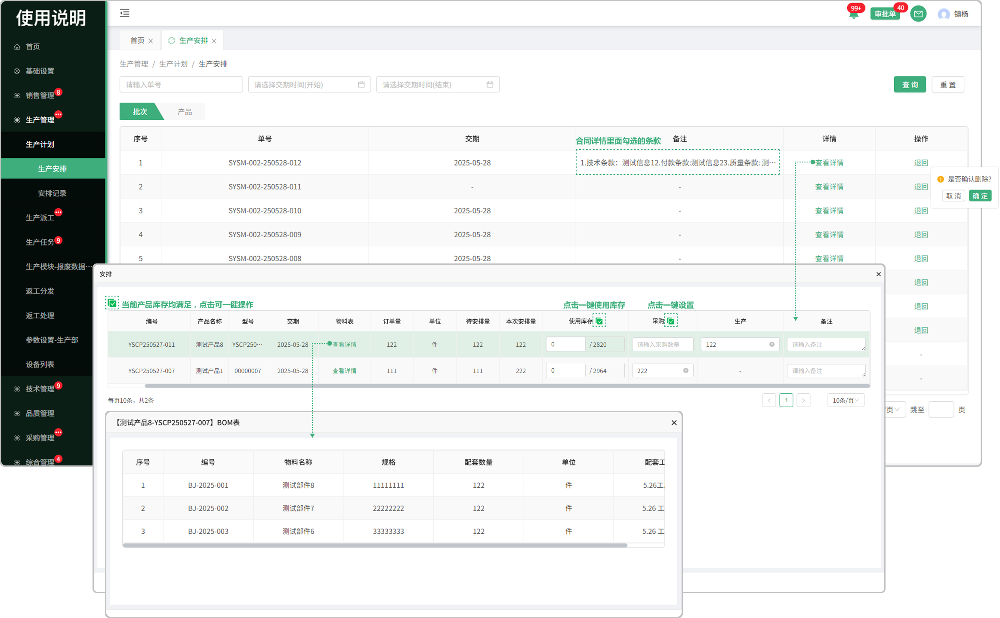
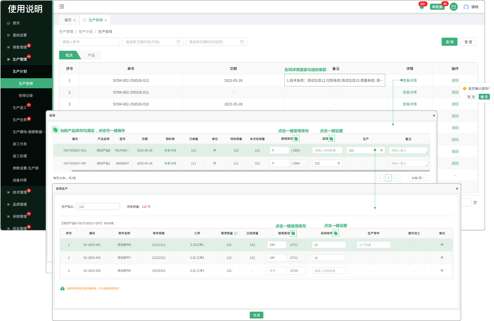
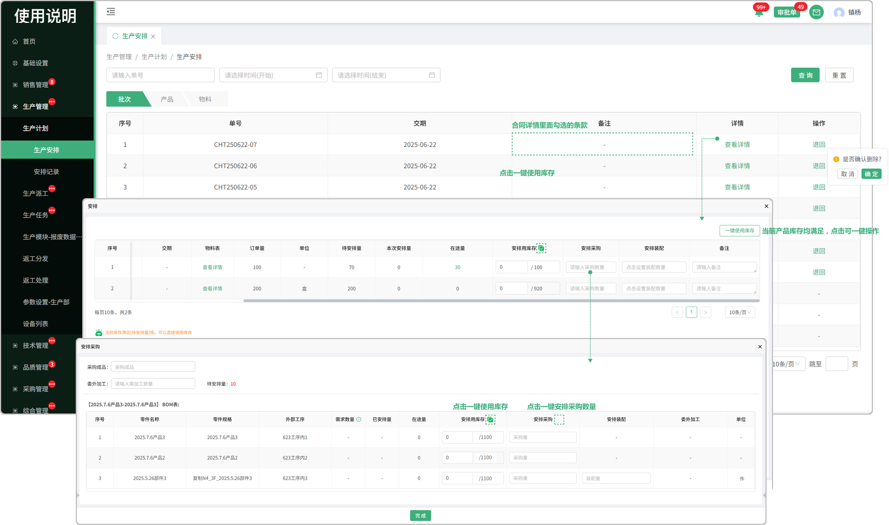
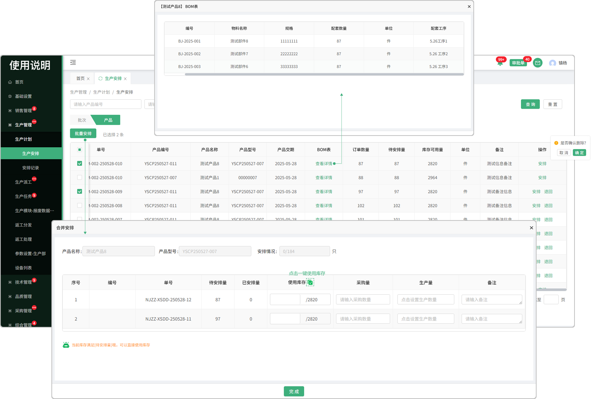
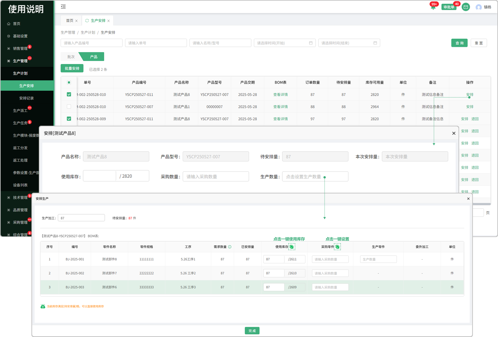
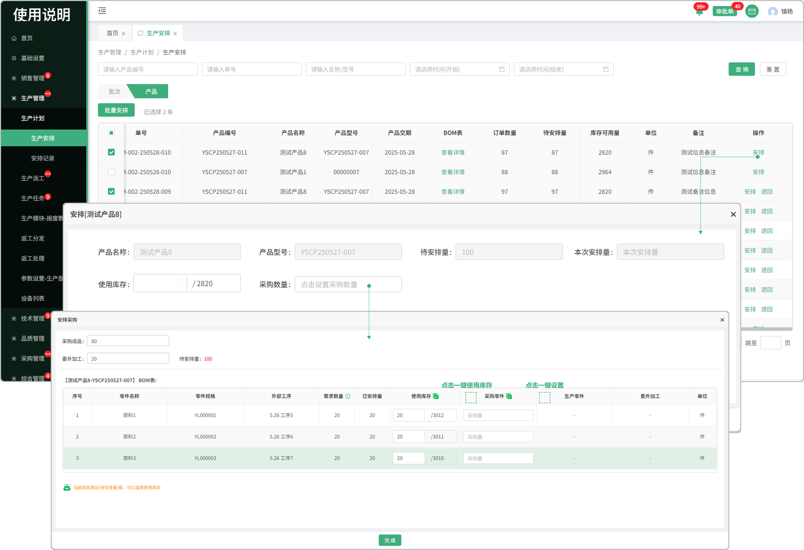

# 生产安排

> 销售订单完成排单后，生产安排列表根据销售订单生成对应的任务,目前分为批次维度和产品维度

### 1.批次维度
* 可通过单号，和交期的时间进行查询
* 退回功能：未进行安排时，可退回操作。(退回操作后数据返回到销售订单列表中，状态成为未处理状态，可重新进行排单)
* 在安排时可使用库存，生产，采购
* 一键操作：当前批次中所有产品库存均满足时，可一键安排使用库存
* 物料表：点击显示这个产品所需的配套物料

#### 1.批次维度走生产
* 如果这个产品有工艺路线，工艺路线是内部路线时可走生产安排 

* 点击进入弹窗设置生产数量

  -生产加工时可使用库存，采购，委外加工，如果生产的这个零件/物料有工艺路线时还可以走生产

* 如果库存满足时可一键使用库存，采购零件也可一键点击设置
* 安排生产时已安排量不能超过需求数量，超过将无法安排

#### 2.批次维度走采购

* 可走采购安排，采购安排的信息会流转到采购管理-缺料列表中进行分发，询价完结等
* 如果这个产品有工艺路线，工艺路线是外部路线时可走采购安排
* 击进入弹窗设置采购数量

  -可直接采购成品或委外加工

* 如果库存满足时可一键使用库存，采购零件也可一键点击设置
* 安排采购时已安排量不能超过需求数量，超过将无法安排

### 2.产品维度安排
* 可通过产品编号，单号，名称/型号，的时间进行查询
* 退回功能：未进行安排时，可退回操作。(退回操作后数据返回到销售订单列表中，状态成为未处理状态，可重新进行排单)
* BOM表：点击可查看这个产品所用到的物料名称

#### 1.批量安排

* 只支持相同产品的合并安排
* 可使用库存，走采购，走生产
* 库存满足时支持一键使用库存

#### 2.产品维度走生产

* 如果这个产品有工艺路线，工艺路线是内部路线时可走生产安排

* 点击进入弹窗设置生产数量

  -生产加工时可使用库存，采购，委外加工，如果生产的这个零件/物料有工艺路线时还可以走生产

* 如果库存满足时可一键使用库存，采购零件也可一键点击设置
* 安排生产时已安排量不能超过需求数量，超过将无法安排

#### 3.产品维度走采购

* 可走采购安排，采购安排的信息会流转到采购管理-缺料列表中进行分发，询价完结等
* 如果这个产品有工艺路线，工艺路线是外部路线时可走采购安排
* 击进入弹窗设置采购数量

  -可直接采购成品或委外加工

* 如果库存满足时可一键使用库存，采购零件也可一键点击设置
* 安排采购时已安排量不能超过需求数量，超过将无法安排

