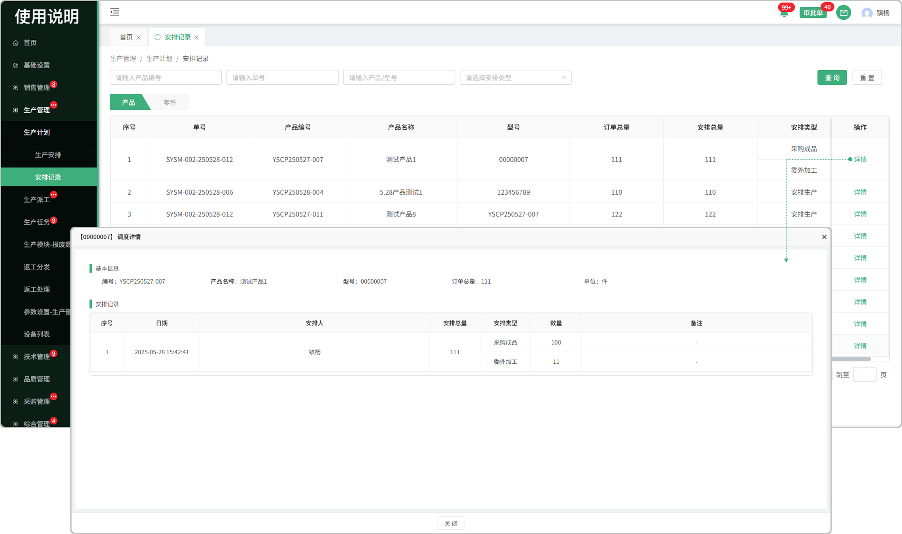
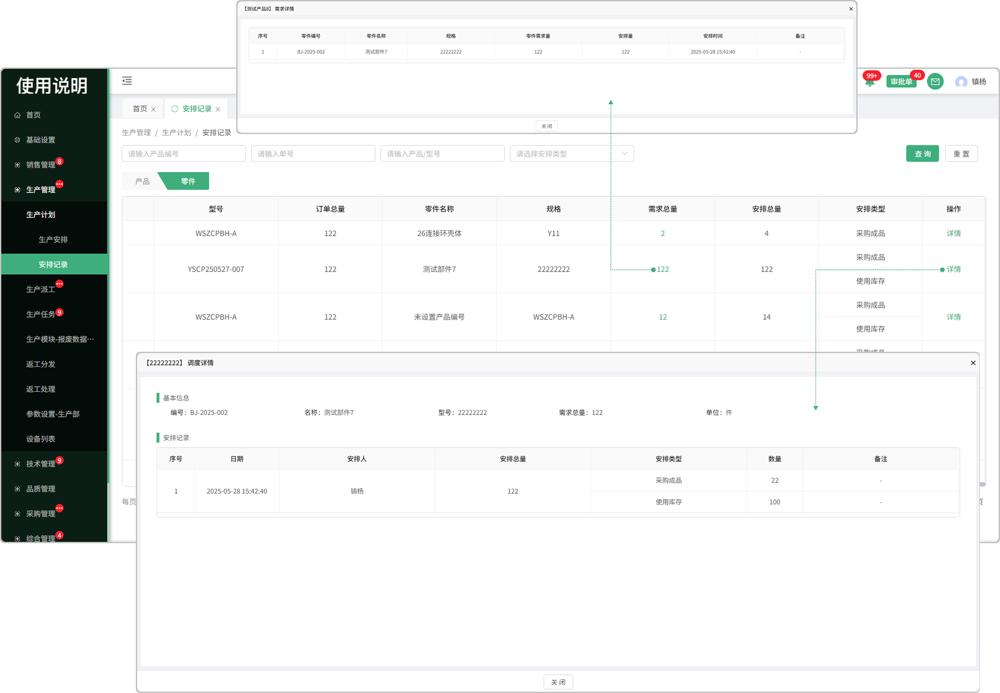

# 生产记录

> "生产记录“位于生产管理板块，生产记录，用来记录生产安排操作,一个是产品维度，一个是零件维度

#### 1. 产品维度

* 支持产品编号，单号，产品/型号，安排类型的查询

* 点击详情可查看这个产品的基础信息和安排记录

#### 2.零件维度

* 支持单号，产品编号，产品/型号，安排类型的查询

* 点击详情可查看这个零件的基本信息和安排记录

* 需求总量：点击可查看零件编号，零件名称，规格，零件需求量，安排量，安排时间，备注信息

