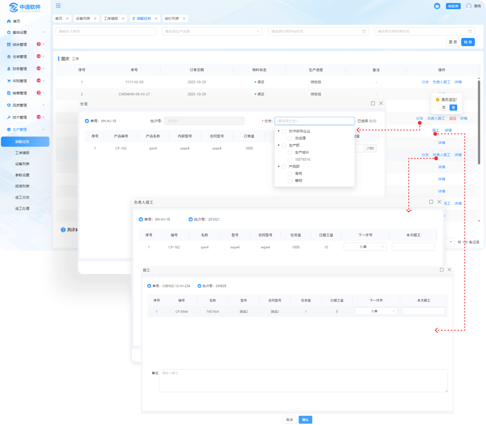
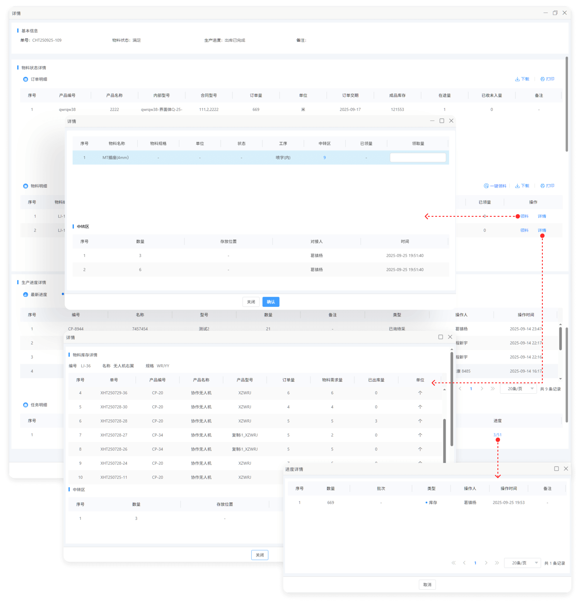
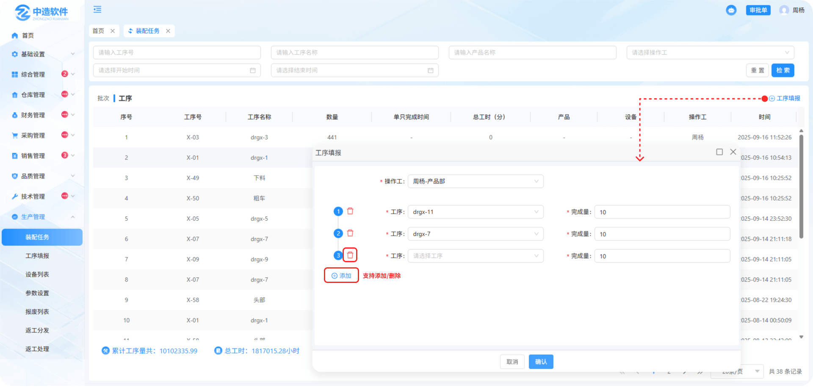

# 装配任务

> “装配任务列表”位于“生产管理板块” 在装配任务列表中可操作分发，负责人报工，报工，退回，查看详情等操作，也可切换工序表单进行工序填报

## 批次

#### 1.分发

* 点击分发按钮可将选中批次下的产品分发指定人员完成

  -可选择多明人员

#### 2.报工

* 点击报工按钮可进行报工操作

  -在下一环节中可选中入库（直接入库），转组（转给下一道工序的人或者下面的人）

#### 3.负责人报工

* 点击负责人报工按钮可进行报工

  -在下一环节中可选择入库（直接入库），质检（送去品质管理的成品检验中质检）

#### 4.退回

* 在物料满足且待安排的情况下支持退回

#### 5.详情

* 点击详情按钮可查看，基本信息，物料状态详情，物料明细，生产进度详情，任务明细

* 物料状态详情：支持下载/打印

* 物料明细：支持下载/打印/领料/查看详情

  -可点击一键领料按钮进行快速领料或单一点击领料按钮进行领料

  -物料明细详情中可查看物料库存的详情信息和中转区信息

* 生产进度：可查看生产的最新进度和详细信息

* 任务明细：可查看任务的信息与进度

  -点击进度下对应的数字可查看进度详情

## 工序

#### 1.工序填报

* 可在工序填报列表中查看所填报的工序或新增工序填报 

