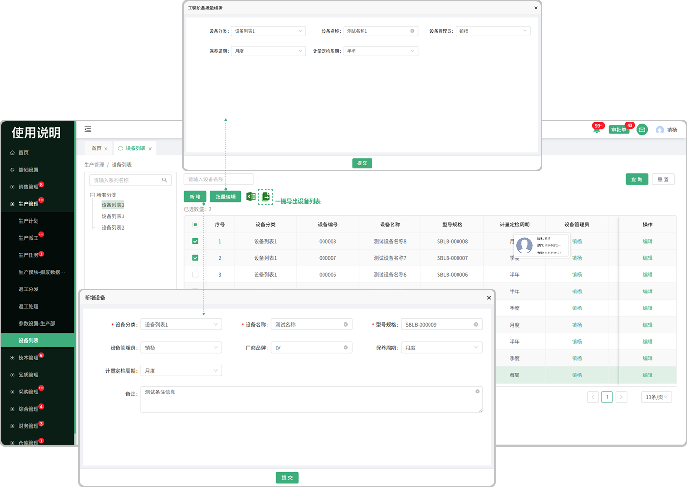
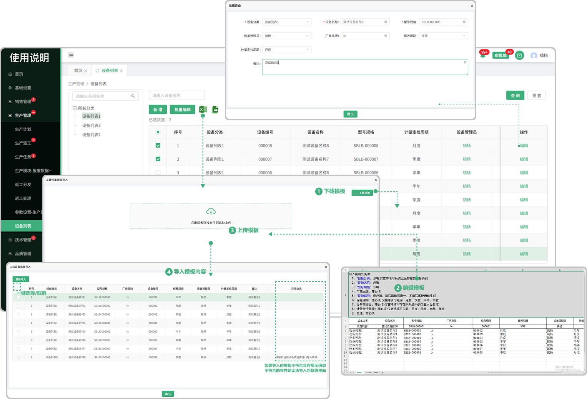

# 设备列表

> “设备列表”位于“生产管理板块” ，可新增相对应的设备分类 ，在分类中添加所需设备

### 1. 新增设备

* 点击可新增设备，新增的设备支持编辑

#### 2.批量编辑

* 先勾选需要批量编辑的设备才能触发批量编辑按钮（默认置灰，只有勾选以后才提亮）

* 可一键选择/取消

#### 3.导出

* 点击导出图标可将系统内的设备信息导出来

#### 4.设备管理员

* 悬浮在人员名称上面可查看这个员工的基本信息

#### 5.导入

* 点击导入，先下载模板（注意下载的模板只适用于批量导入设备里面上传的模板)
* 点开下载的模板进行编辑（编辑时请阅读表格上面的提示文案，以防导入时出现错误，从而无法导入）
* 点击或者拖拽所保存的模板（只有在设备的批量导入中下载的模板才能上传，其他无效）进行上传
* 上传成功会弹出显示上传的数据，可选择性导入或者一键导入（如果无法导入，请滑动到页面最后，查看提示信息，可能存在编辑时出现的错误，需从新更改再次上传）

#### 6.编辑

* 可在原有的设备上进行修改信息

