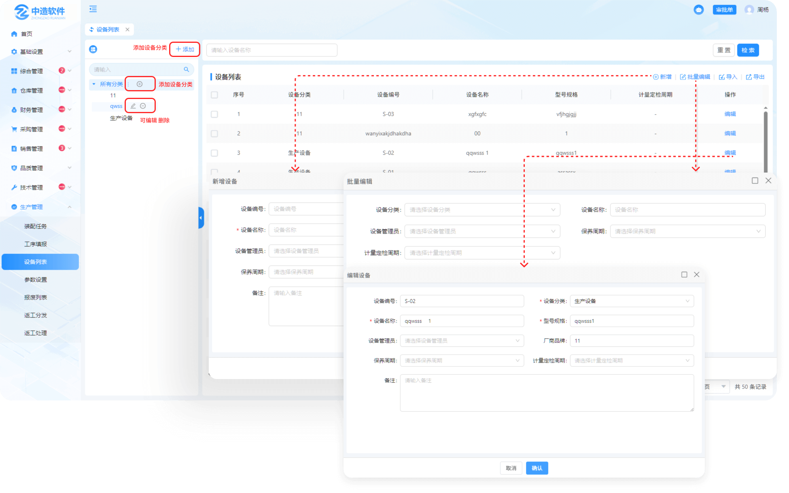
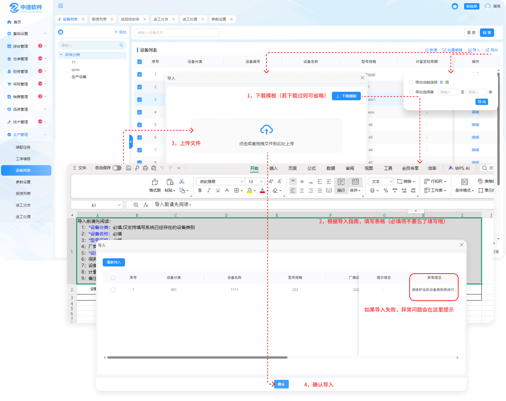

# 设备列表

> "设备列表"位于生产管理板块 ，可新增相对应的设备分类 ，在分类中添加所需设备
#### 1. 分类

* 默认展示全部分类下的所有设备，分类支持新增、删除、修改操作

#### 2. 新增设备

* 点击可新增设备，新增的设备支持编辑

#### 3.批量编辑

* 选勾选序号前需要编辑的设备，点击批量编辑按钮可进行批量编辑

* 可一键选择/取消

#### 4.编辑

* 可修改设备的信息

#### 5.导入

* 点击导入，先下载模板（注意下载的模板只适用于批量导入设备里面上传的模板)
* 点开下载的模板进行编辑（编辑时请阅读表格上面的提示文案，以防导入时出现错误，从而无法导入）
* 点击或者拖拽所保存的模板（只有在设备的批量导入中下载的模板才能上传，其他无效）进行上传
* 上传成功会弹出显示上传的数据，可选择性导入或者一键导入（如果无法导入，请滑动到页面最后，查看提示信息，可能存在编辑时出现的错误，需从新更改再次上传）

#### 6.导出

* 点击导出按钮分为两种导出样式

  -先勾选需导出的内容，点击导出按钮选择第一个选项

  -点击导出按钮，选择第二个选项，手动输入导入1~N条

