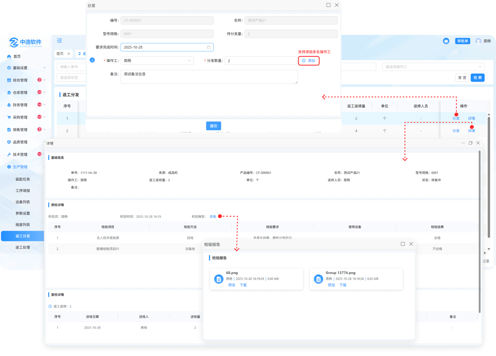

# 返工分发

> “返工分发列表”位于“生产管理板块” ，在品质管理成品检任务中，员工检验的不合格审批所选的是返工返修时，数据会带到生产管理-返工分发列表中

#### 1.分发

* 对需要返工返修的产品进行分发处理，指派返工人员完成

* 支持分发多名人员去完成任务

#### 2.详情

* 点击详情按钮可查看产品的基本信息，质检详情，复检详情

* 质检详情中可查看检验报告

* 复检详情中记录了返工处理列表中送检的详细内容信息

