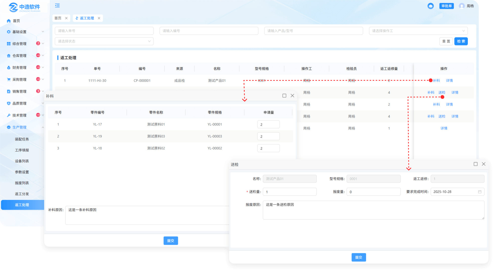
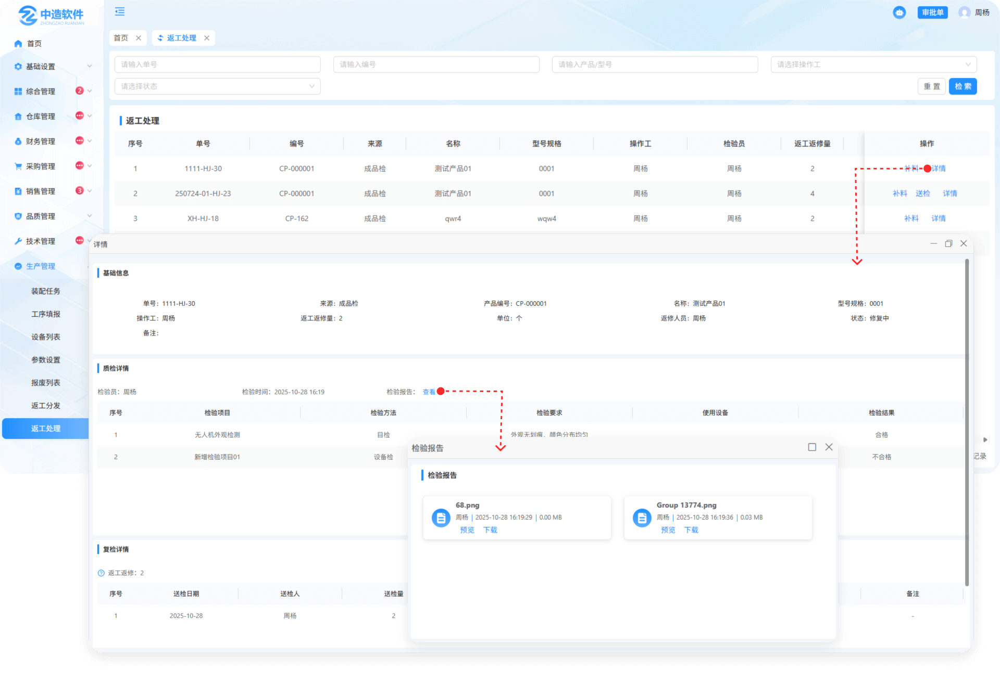
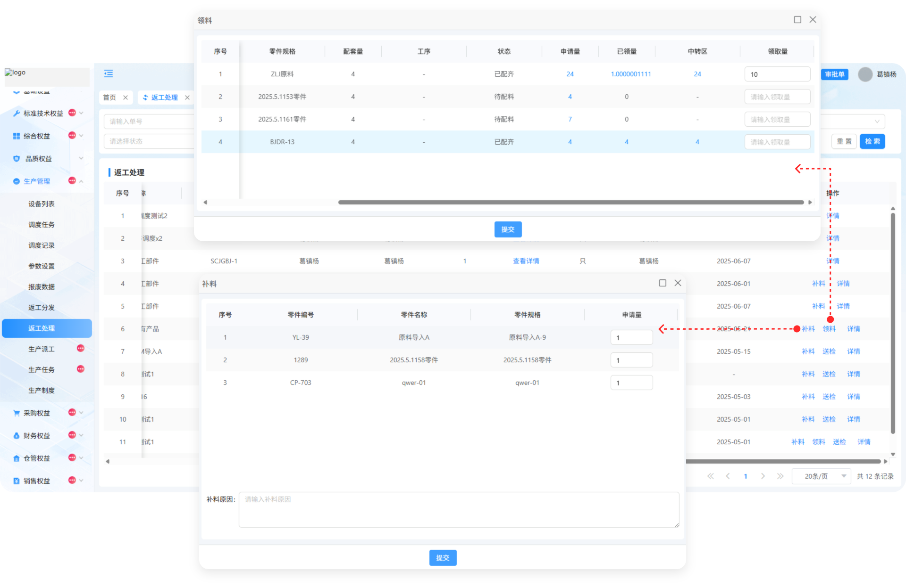
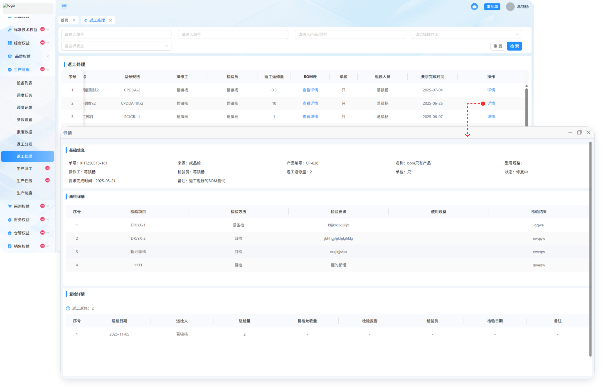
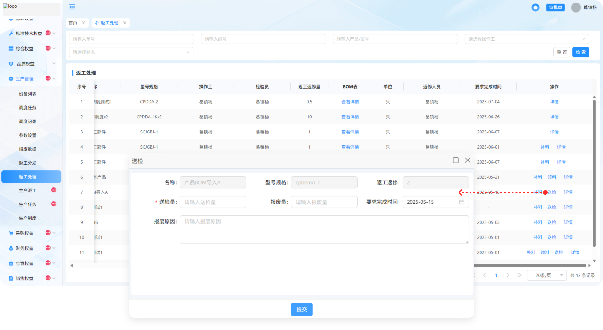
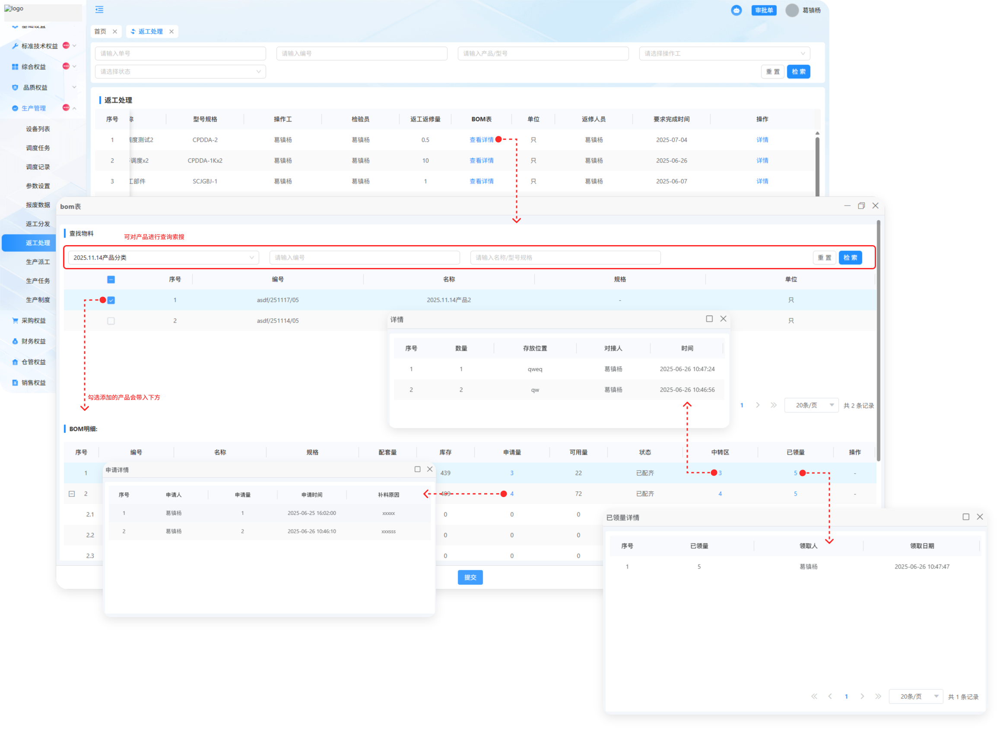

# 返工处理

> "返工处理列表"位于"生产管理板块" 来源于返工分发列表分发下来的任务，可操作补料，送检，查看详情

#### 1.补料

* 点击补料按钮输入申请量，补料原因
* 提交完成后等待仓库管理出库所领的料
* 出库完成以后，显示领料按钮

#### 2.送检

* 点击送检按钮输入送检量，报废量
* 送检完成以后，送检按钮消失，送检的产品会到品质管理中的不合格品列表中复检

#### 3.详情

* 点击详情按钮可查看产品的基本信息，质检详情，复检详情

* 质检详情中可查看检验报告

* 复检详情中记录了返工处理列表中送检的详细内容信息

 

# 以下是有路线版本

#### 1.补料

* 点击补料按钮输入申请量，补料原因
* 提交完成后等待仓库管理出库所领的料
* 出库完成以后，显示领料按钮

#### 2.领料
* 点击领料按钮输领取量
* 申请量：点击可查看补料时申请的数量，人员，时间
* 中转区：出库时所填写，点击可查看出库量，存放位置，出库人员，出库时间
* 已领量：领取完成后可查看领取的数量，人员，时间

#### 3.详情

* 点击详情按钮可查看基本信息和质检详情以及复检详情

#### 4.送检

* 点击送检按钮输入送检量，报废量
* 送检完成以后，送检按钮消失，送检的产品会到品质管理中的不合格品列表中复检

#### 5.BOM表

* 点击查看这个产品所用的物料明细，且支持搜索查询和添加
* 申请量：点击可查看补料时申请的数量，人员，时间
* 中转区：点击可查看中转区详情
* 已领量：点击可查看已经领取的详情

