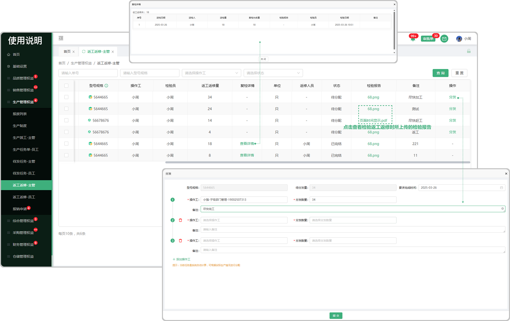

# 返工返修-主管

> “返工返修-主管列表”位于“生产管理板块” ，在品质部成品检、过程检员工中、入厂检中，员工检验的不合格审批产品所选的是返工返修时，数据会带到生产部门-返工返修主管列表

#### 1.分发

* 对需要返工返修的数据进行分发处理，指派返工人员

* 支持分发多名人员

#### 2.检验报告

* 点击可查看品质部检验时所上传的检验报告

#### 3.复检详情

* 点击可查看人员所复检的详细情况

