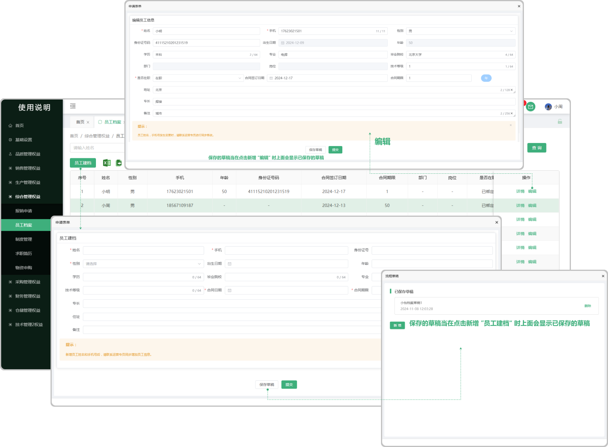
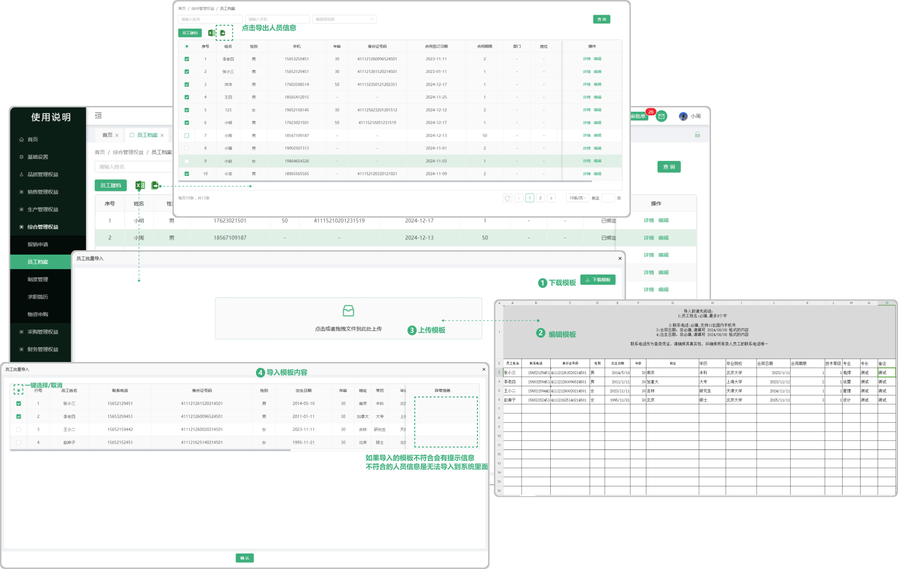

# 员工档案

> 员工档案列表位于综合部，可新增员工建档、编辑、批量导入员工信息、批量导出员工信息

#### 1.员工建档
* 可新建员工建档

  -输入身份证号后，自动计算出生日期和年龄

  -带红色标注的是必填项

  -新增员工姓名和手机号后，请联系运营管理员同步增加员工信息

#### 2.编辑功能
* 可编辑之前所创建的员工建档(置灰的代表不可更改)
   
  -支持修改手机号，但不会更新到基础设置-员工信息中，需要通知运营管理员进行信息同步

  -输入身份证号后，自动计算出生日期和年龄。
* 是否在职

  -在职（如果在职页面显示已绑定）

  -离职（如果离职页面显示未绑定）

#### 3.保存草稿功能
* 编辑过程中，可以将员工档案暂存下来， 再次打开编辑的时候会显示之前所保存的草稿

#### 4.批量导入
* ● 使用下载的模版，可直接进行员工档案信息批量导入，对于已存在的数据，重复导入时，进行补全信息

    -例如：人员张三已存在，只填写了姓名，手机号，使用模版填写了专业，专长，再次导入时会将缺少的信息进行补全。\

 -1.点击批量导入，先下载模板（注意下载的模板只适用于批量导入员工档案里面上传的模板)

 -2.点开下载的模板进行编辑（编辑时请阅读表格上面的提示文案，以防导入时出现错误，从而无法导入）

 -3.点击或者拖拽所保存的模板（只有在员工建档的批量导入中下载的模板才能上传，其他无效）进行上传

 -4.上传成功会弹出显示上传的数据，可选择性导入或者一键导入（如果无法导入，请滑动到页面最后，查看提示信息，可能存在编辑时出现的错误，需从新更改再次上传）
 
#### 5.批量导出
 -点击批量导出按钮
 -勾选需要导出的字段
 -再次点击批量导出按钮导出
 
