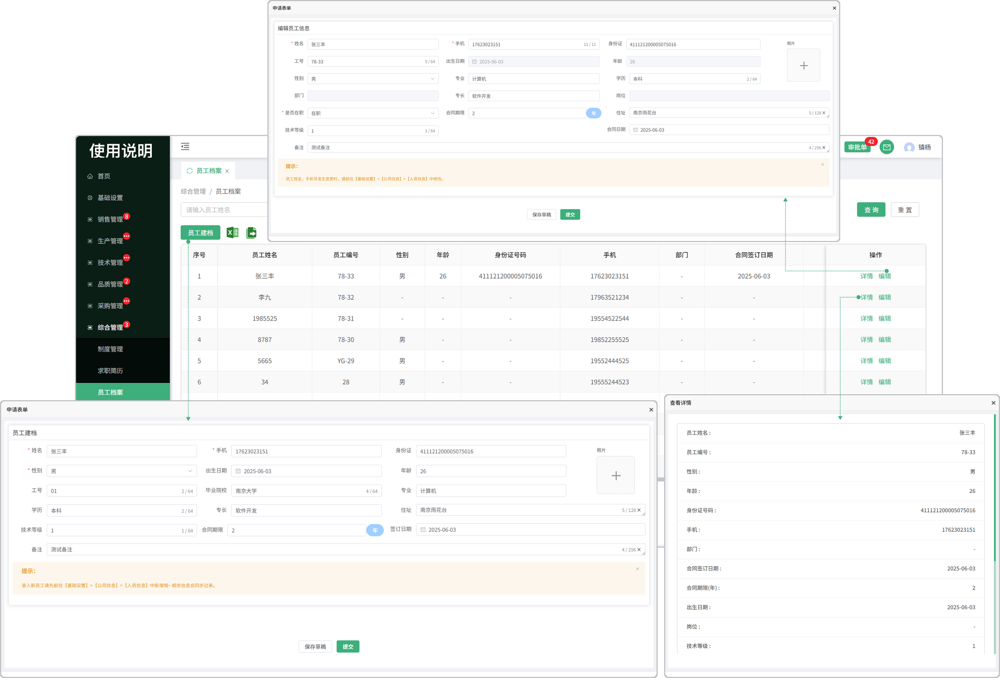

# 员工档案

> 员工档案列表位于综合部，可编辑、批量导入员工信息、批量导出员工信息，表头设置信息，员工档案和基础设置-人员信息数据同步。（以基础设置-人员信息中的数据为准，同步至员工档案）

#### 1.编辑功能

* 在编辑之前所创建的员工建档(置灰的代表不可更改)
   
  -支持修改手机号，但不会更新到基础设置-员工信息中，需要通知运营管理员进行信息同步

  -输入身份证号后，自动计算性别，出生日期，年龄

* 是否在职

  -是的情况下是代表在职，否的情况下是代表离职（此地方不可编辑，是从基础信息-员工权限页面中同步过来的，是否在职取决于员工权限页面的启用/停用）

#### 2.表头设置

* 点击表头设置按钮设置列表表头的标题是否显示

#### 3.批量导入
* 使用下载的模版，可直接进行员工档案信息批量导入，对于已存在的数据，重复导入时，进行补全信息

    -例如：人员张三已存在，只填写了姓名，手机号，使用模版填写了专业，专长，再次导入时会将缺少的信息进行补全。\

  -1.点击批量导入，先下载模板（注意下载的模板只适用于批量导入员工档案列表里面上传的模板)

  -2.点开下载的模板进行编辑（编辑时请阅读表格上面的提示文案，以防导入时出现错误，从而无法导入）

  -3.点击或者拖拽所保存的模板（只有在员工档案列表的批量导入中下载的模板才能上传，其他无效）进行上传

  -4.上传成功会弹出显示上传的数据，可选择性导入或者一键导入（如果无法导入，请滑动到页面最后，查看提示信息，可能存在编辑时出现的错误，需从新更改再次上传）
 
#### 4.批量导出 

  -点击导出按钮 
  
  -勾选需要导出的信息

  -也可手动输入需导出N条信息进行导出

  -再次点击导出按钮导出

  