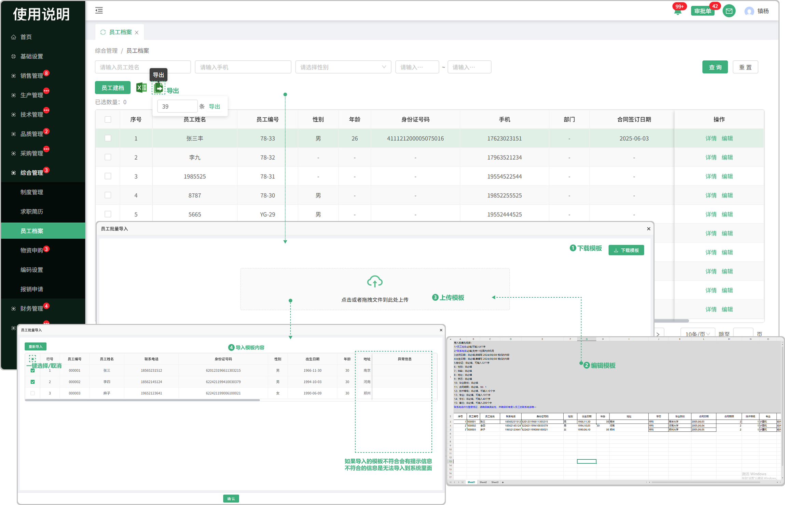

# 员工档案

> 员工档案列表位于综合部，可新增员工建档、编辑、批量导入员工信息、批量导出员工信息，员工档案和基础设置-人员信息数据同步。（以基础设置-人员信息中的数据为准，同步至员工档案）

#### 1.员工建档

* 可新建员工建档

  -输入身份证号后，自动计算性别，出生日期，年龄

  -带红色标注的是必填项

  -新增员工姓名和手机号后，请联系运营管理员同步增加员工信息

* 提示：录入新员工请先前往【基础设置】>【公司信息】>【人员信息】中新增哦~ 相关信息会同步过来

#### 2.编辑功能

* 在编辑之前所创建的员工建档(置灰的代表不可更改)
   
  -支持修改手机号，但不会更新到基础设置-员工信息中，需要通知运营管理员进行信息同步

  -输入身份证号后，自动计算性别，出生日期，年龄

* 是否在职

  -在职（如果在职页面显示已绑定）

  -离职（如果离职页面显示未绑定）

#### 3.保存草稿功能
* 编辑过程中，可以将员工档案暂存下来， 再次打开编辑的时候会显示之前所保存的草稿

#### 4.详情

* 点击详情可查看员工的姓名，编号，性别，年龄，身份证号，手机号，部门，合同签订日期，合同期限，出生日期，岗位，技术等级

#### 4.批量导入
* 使用下载的模版，可直接进行员工档案信息批量导入，对于已存在的数据，重复导入时，进行补全信息

    -例如：人员张三已存在，只填写了姓名，手机号，使用模版填写了专业，专长，再次导入时会将缺少的信息进行补全。\

 -1.点击批量导入，先下载模板（注意下载的模板只适用于批量导入员工档案列表里面上传的模板)

 -2.点开下载的模板进行编辑（编辑时请阅读表格上面的提示文案，以防导入时出现错误，从而无法导入）

 -3.点击或者拖拽所保存的模板（只有在员工档案列表的批量导入中下载的模板才能上传，其他无效）进行上传

 -4.上传成功会弹出显示上传的数据，可选择性导入或者一键导入（如果无法导入，请滑动到页面最后，查看提示信息，可能存在编辑时出现的错误，需从新更改再次上传）
 
#### 5.批量导出
  -点击导出按钮 
  
  -勾选需要导出的信息

  -也可手动输入需导出N条信息进行导出

  -再次点击导出按钮导出
 
