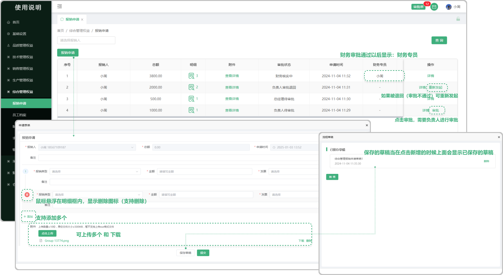
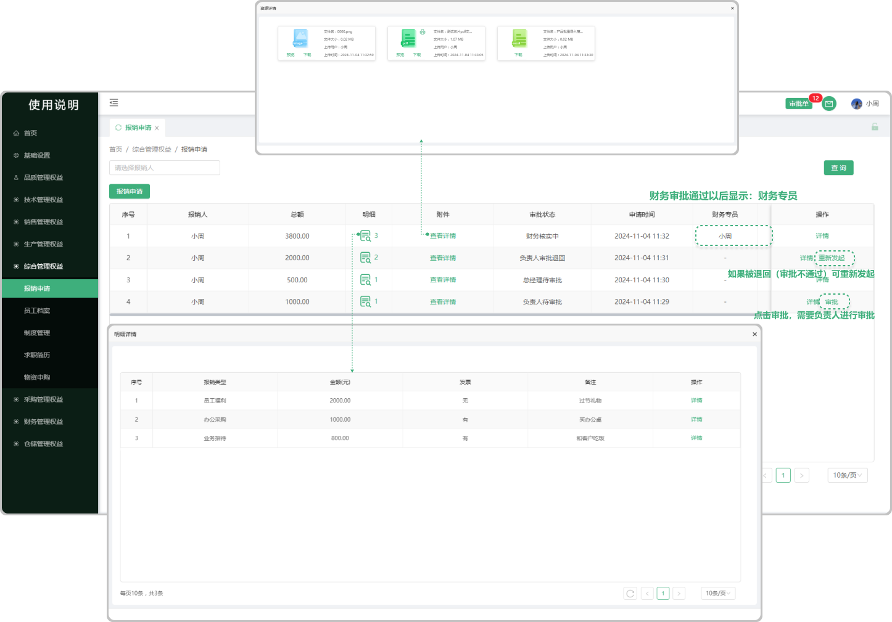

# 报销申请

> "报销申请"位于综合管理板块，在页面中可以新增 “报销申请“需要审批人和经理去审批，如果审批被退回，可”重新发起“进行审批 

 #### 1.新增报销申请

* 点击报销申请按钮可新增申请单

  -可添加多个报销明细（鼠标悬浮在某个报销类型上面出现删除图标，点击图标可删除这个报销类型）

  -可上传多个附件（支持下载、删除）
  
  -当保存草稿后，再次点击 "报销申请" 的时候会显示之前所保存的草稿

#### 2.审批

* 新增完报销申请的单子，需要审批通过

  -分为审批人、经理、财务（需有权限才可以审批）到基础设置的 ”流程权限管理" 中去设置审批的权限
 
  -财务审批通过后页面显示财务专员（这个财务元的姓名）

#### 3.重新发起

* 如果在审批的过程中被负责人、经理、财务等任意一方给退回的情况向，页面将显示重新发起

  -可再次点击重新发起这个报销类型去审批

#### 4.明细

* 所上传的报销类型会被记录在明细里面

  -点击明细下方对应的图标可查看在新增报销申请时的弹窗中所添加费用的明细(支持添加多个明细)

#### 5.附件

* 在新增报销申请的弹窗中所上传的文件（支持预览、下载，pdf文件支持打印）

