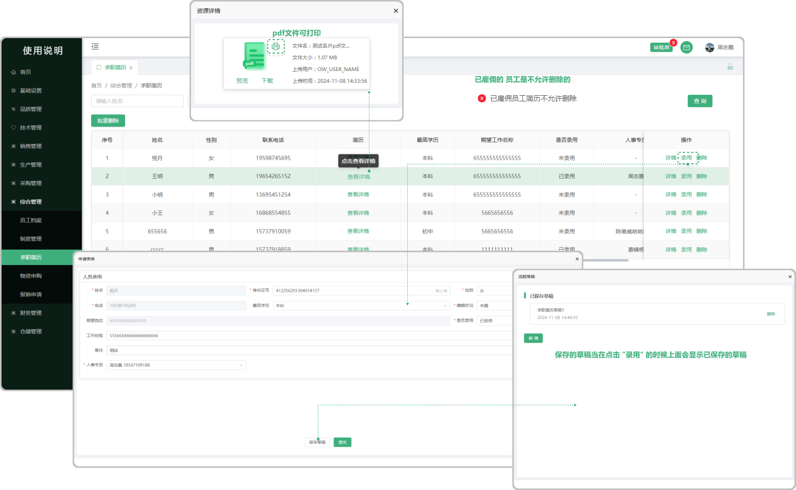

# 求职简历

> “求职简历”列表位于综合管理模板

#### 1.信息来源

* 求职简历列表中的信息来源于，官网 “招贤纳士” 页面中申请填写的信息

#### 2.录用

* 点击录用后弹出弹窗输入信息可录用该人员
  
  -已雇佣的员工是不允许删除的

  -当保存草稿后，再次点击 "录用" 的时候会显示之前所保存的草稿\

#### 3.履历

* 从官网 “招贤纳士” 中带过来的求职简历（点击详情可预览、下载、打印）

