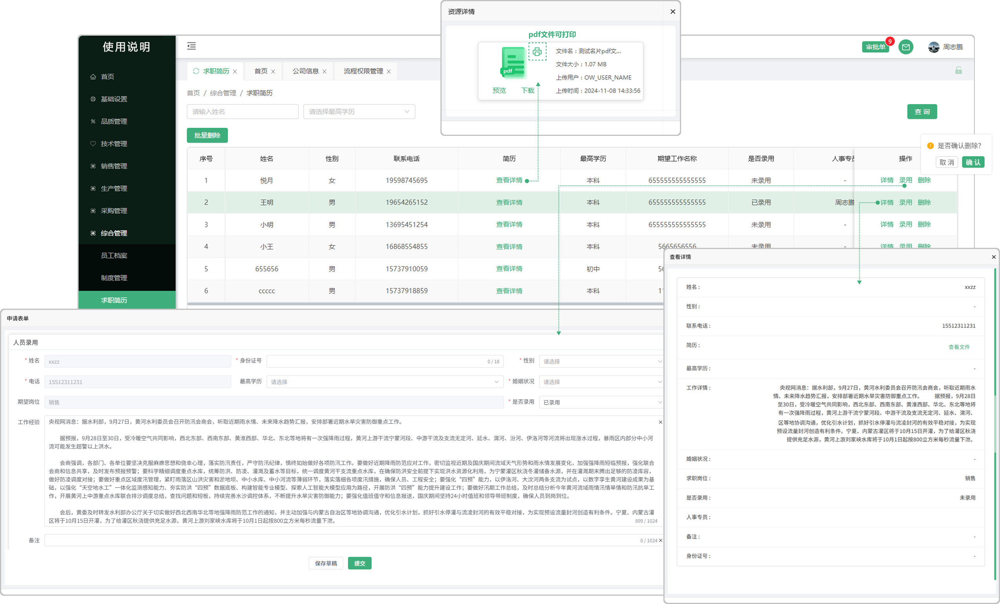

# 求职简历

> “求职简历”列表位于综合管理模板，可查看官网申报的简历投递

#### 1.信息来源

* 求职简历列表中的信息来源于，官网 “招贤纳士” 页面中申请填写的信息

#### 2.录用

* 点击录用后弹出弹窗输入信息可录用该人员
  
  -已雇佣的员工是不允许删除的

#### 3.简历

* 从官网 “招贤纳士” 中带过来的求职简历（点击详情可预览、下载、打印）

#### 4.删除

 * 点击删除按钮可删除对应的数据

#### 5.批量删除

* 勾选所需删除的简历点击批量删除按钮可批量删除

