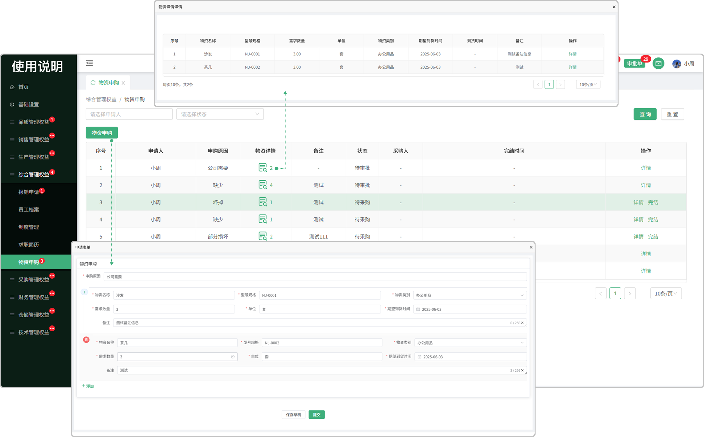
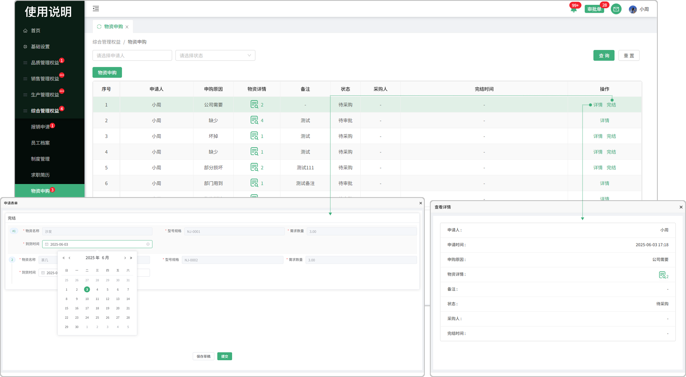

# 物资申购

> "物资申购"列表位于综合管理板块，在"物资申购列表"中新增相对应的"申购物资",需审批，到货可完结

#### 1. 物资申请

* 点击申请按钮，填写申购原因

* 添加购物信息，可添加多个

  -输入物资名称，型号规格，需求量，单位，备注

  -选择物资类别，期望到货时间

#### 2.保存草稿功能

* 点击保存的草稿会在点击物资申购时显示出来

#### 3.物资详情

* 点击可查看新增物资申购时所添加的物资详情

#### 4.详情

* 点击详情可查看，申请人，申请时间，申购原因，物资详情，备注信息，状态，采购人，完结时间

#### 5.完结

* 所申请的物资，需得到审批，如果审批通过到货后可完结

* 未审批的情况下，状态是待审批状态

* 点击完结按钮，输入到货时间可完结

