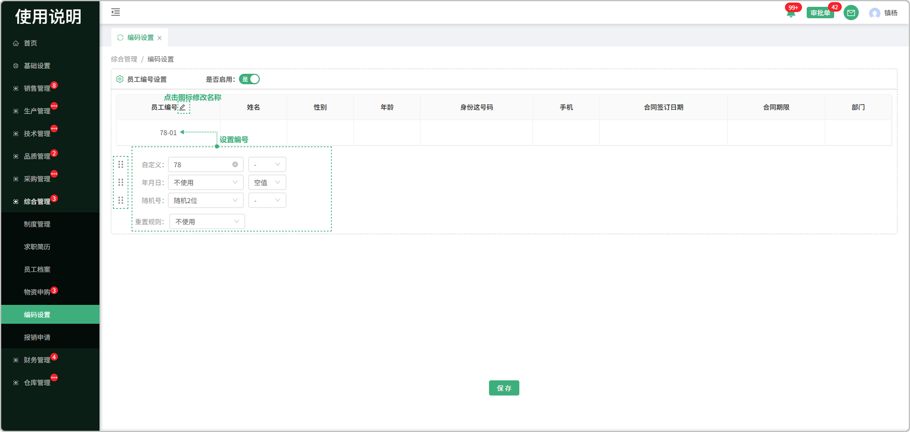

# 采购编码设置

> "采购编码设置"位于综合管理板块，可在编码设置中维护员工编号

#### 1.员工编号

* 是否启用：是代表使用，否代表不使用

* 编号名称：点击修改图标可修改员工编号名称

* 预览：所设置的员工编号可在表头中预览

* 员工编号设置：分为自定义，年月日，随机号，同时可选择符号带入，拖拽前方图标也可调整顺序

* 重置规则：分为日，月，年，不使用，列：选择了日，就代表一日后重置，年就是一年，不使用就是永久

