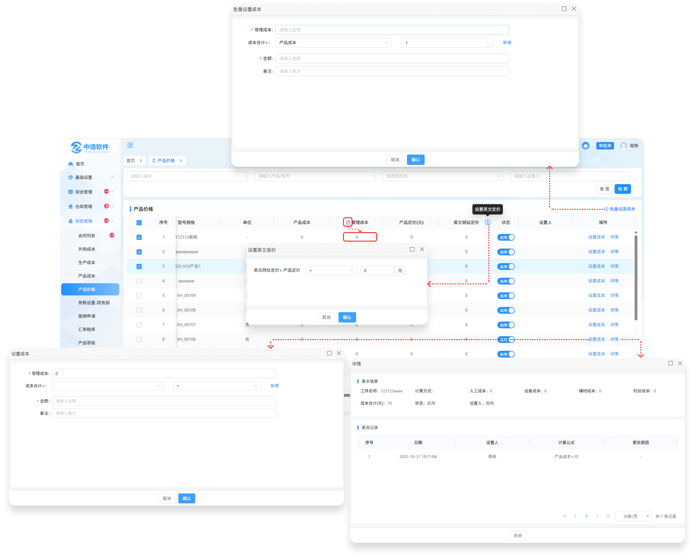

# 产品价格

> "产品价格列表"位于财务管理板块，在"产品价格列表中可设置相对应产品的成本"

#### 1.批量设置成本

* 先勾选序号前的勾选框，点击批量设置按钮可设置所选产品的成本

#### 2.设置成本

* 点击设置成本按钮设置成本

  -可填写管理成本（也可在外面对应的管理成本手动添加）

  -选择成本（产品成本，管理成本）

  -点击新增按钮可添加新的选择框

  -可手动输入自定义钱数

  -点击输入备注

#### 3.管理成本

* 鼠标点击在管理成本下方相对应的表字段中，默认是0，可点击编辑成本

#### 4.详情

* 点击详情可查看基本信息和成本的变更记录

* 如果更改了成本设置，会产生记录到详情中查看

#### 5.状态

* 启用代表可以使用，停用代表不可使用

#### 6.设置人

* 设置完成本后，页面显示设置人员，鼠标点击人员名称可查看人员的基础信息（部门，电话）

