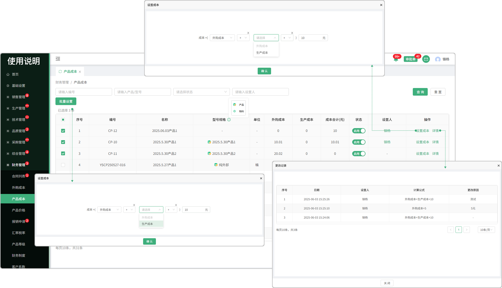

# 产品成本

> "产品成本列表"位于财务管理板块，在"产品成本列表中可设置相对应的成本"

#### 1.批量设置

* 先勾选序号前的勾选框触发批量设置按钮

* 点击批量设置按钮可设置所选产品的成本

#### 2.成本设置

* 点击设置成本按钮设置成本

  -选择成本（外购成本，生产成本）

  -点击绿色三个点图标可添加新的选择框

  -可手动输入自定义钱数

#### 3.详情

* 点击详情可查看成本的变更记录

* 如果更改了成本设置，会产生记录到详情中查看

#### 4.状态

* 启用代表可以使用，停用代表不可使用

#### 5.设置人

* 设置完成本后，页面显示设置人员，鼠标悬浮人员名称可查看人员的基础信息（项目，部门，电话）

