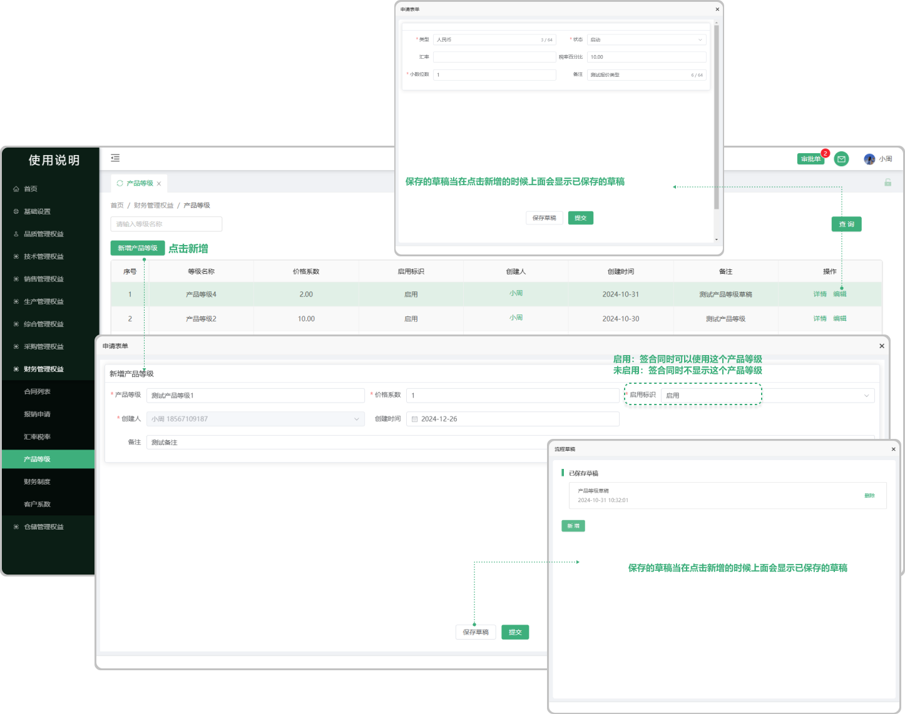

# 产品等级

> "产品等级"位于财务管理板块，在"产品等级列表"中新增相对应的"产品等级" 支持编辑更改 ，在新增合同的时候会用到产品等级

#### 1. 新增产品等级

* 点击新增可以新增 “产品等级”

* 启用标识

  -启用（签合同时可以使用这个产品等级）

  -未启用（签合同时不显示这个产品等级）

#### 2.保存草稿功能、

* 可存为草稿，再次打开新增时显示之前所存的草稿

#### 3.编辑功能

* 可在原有的信息基础上编辑更改之前的信息

