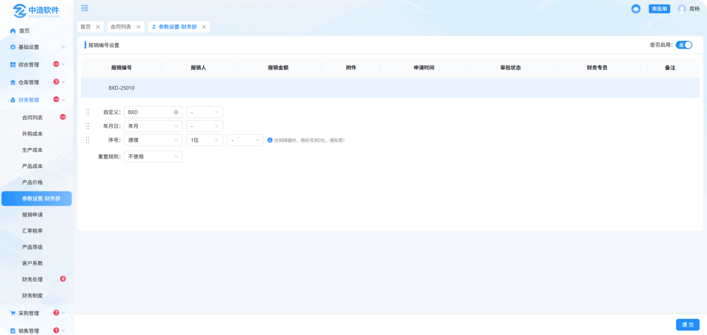

# 财务管理-参数设置

> "参数设置"位于财务管理板块，可在参数设置中进行报销编号设置

#### 1.报销编号设置

* 是否启用：是代表使用，否代表不使用

* 预览：所设置的报销编号设置可在表头中预览

* 报销编号设置：分为自定义，年月日，序号，同时可选择符号带入，拖拽前方图标也可调整顺序

* 重置规则：分为日，月，年，不使用，列：选择了日，就代表一日后重置，年就是一年，不使用就是永久

