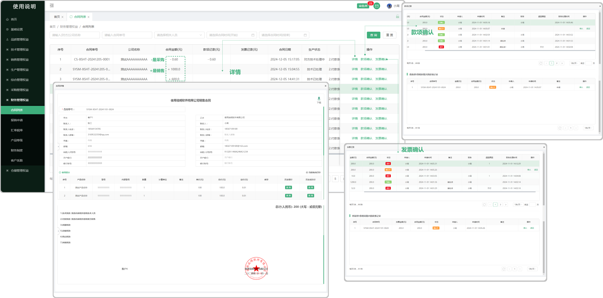

# 财务—合同列表

> "合同列表”位于"财务管理板块，页面包含款项确认、发票确认、这些信息来源于销售管理/采购管理的 "合同列表"中 添加的收款和申请的发票，需要在财务的合同列表中进行审批（确认或者退回）如果有相同批次的发票记录或者款项记录在操作完以后，系统将会吧这些记录展示在所操作的页面下方（可审批 “收款和发票”),表单下面显示当前合同金额（所显示的合同金额只取决于当前页面的合同金额）

#### 1. 款项确认

* 点击可查看款项明细，可确认或者退回
  
  -状态分为、确认中（财务还没有审批）、已确认（财务通过审批）、退回、（财务退回，标注退回原因）
 
  -销售或者采购合同中添加的收付款，带到财务合同中，点击财务合同列表页面中的“款项确认” 确认以后页面显示款项记录

#### 2.发票确认

* 点击可查看发票明细，可确认或者退回

  -状态分为、确认中（财务还没有审批）、已确认（财务通过审批）、退回、（财务退回，标注退回原因）
 
  -销售或者采购合同中添加的申请发票，带到财务合同中，点击财务合同列表页面中的“发票确认”确认以后页面显示发票记录

#### 3.合同金额

* 合同金额下方的 — + 指的是(+销售)（—采购），列表下面展示应付金额、应收金额（展示的金额指属于当前页面）

#### 4.详情

* 详情：点击详情可查看当时在销售管理 “ 合同列表 “ 中这一份合同生成的详情内容

