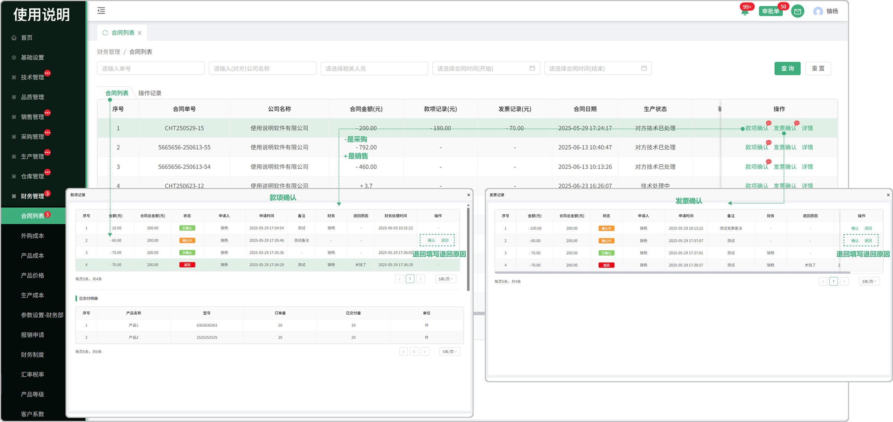
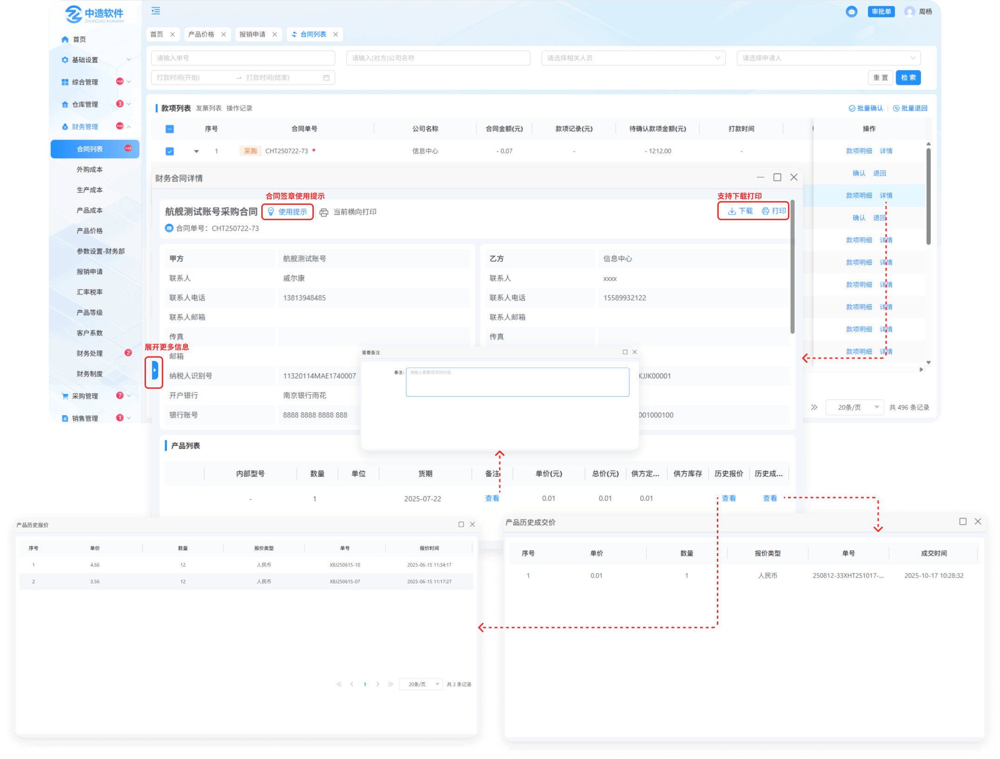

# 财务—合同列表

> "合同列表”位于"财务管理板块，页面包含款项确认，发票确认，详情，这些信息来源于销售管理/采购管理的 "合同列表"中 添加收款/申请的发票，需要在财务的合同列表中进行审批（确认或者退回）表单下面显示当前合同的应收总额，已收总额，应付总额，已付总额 

#### 1. 款项确认

* 点击可查看款项明细，可确认或者退回
  
  -状态分为，确认中（财务还没有审批），已确认（财务通过审批），退回（财务退回，标注退回原因）
 
  -销售或采购合同中添加的收付款，带到财务合同中，点击财务合同列表页面中的“款项确认”进行审批操作

#### 2.发票确认

* 点击可查看发票明细，可确认或者退回

  -状态分为，确认中（财务还没有审批），已确认（财务通过审批），退回（财务退回，标注退回原因）
 
  -销售或采购合同中添加的申请发票，带到财务合同中，点击财务合同列表页面中的“发票确认”进行审批操作

#### 3.合同金额

* 合同金额旁边的 — + 指的是(+销售)（—采购）
  
  -应收总额，已收总额，应付总额，已付总额，根据销售,采购全部合同进行汇总显示

#### 4.详情

* 详情：点击详情可查看当时在销售管理 “ 合同列表 “ 中，这一份合同生成的详情内容

