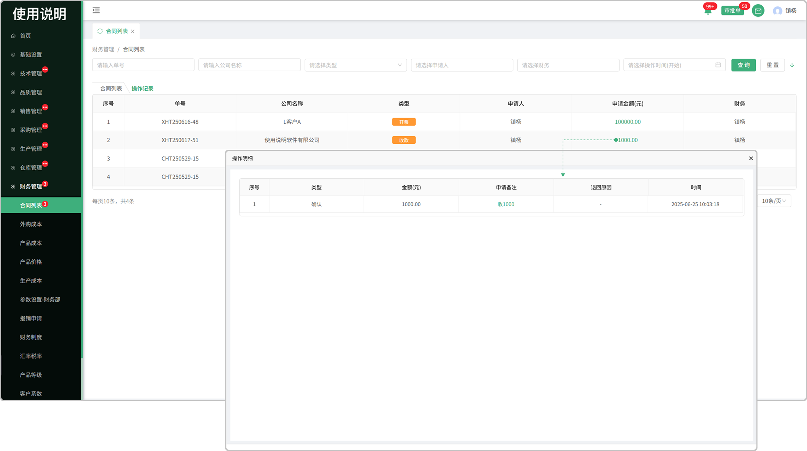
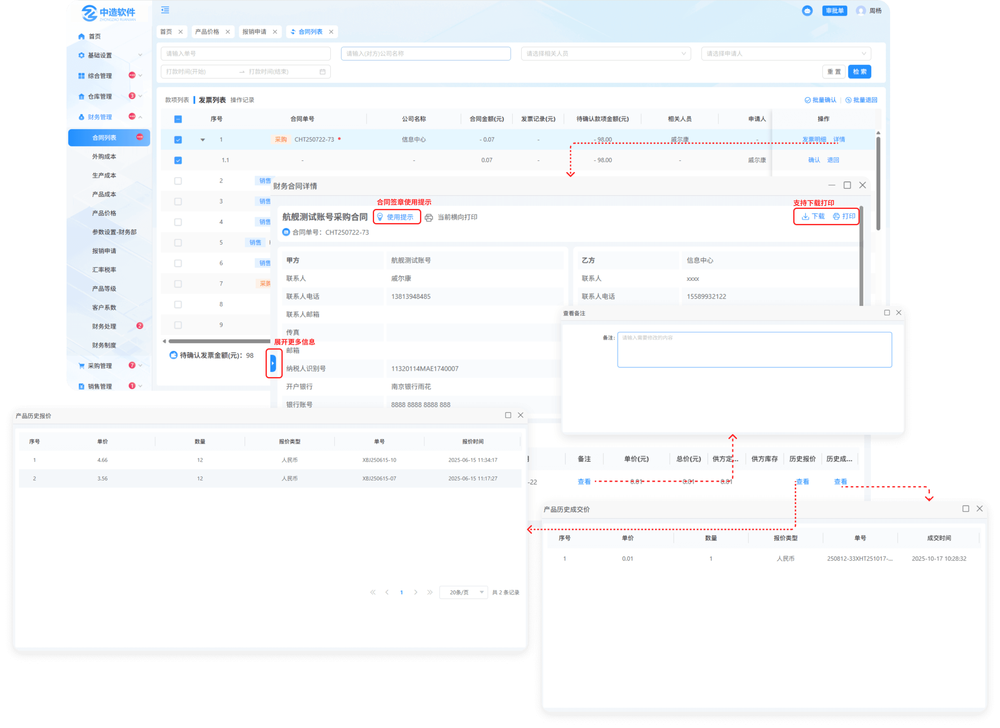
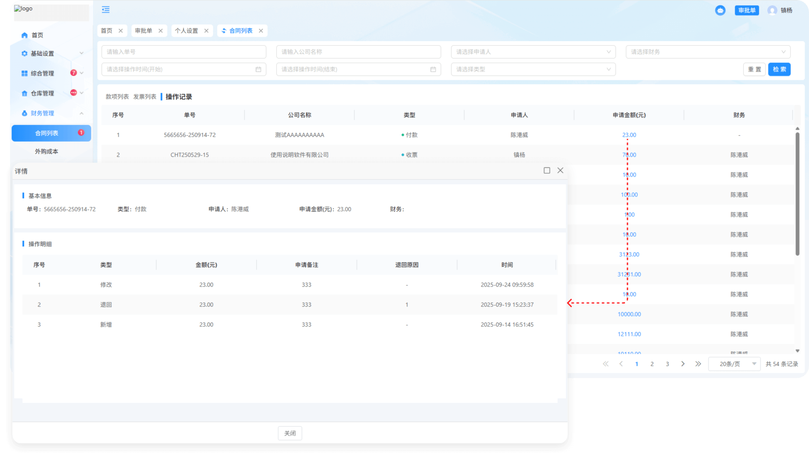

# 财务—合同列表

> "合同列表"位于财务管理板块，页面包含款项列表，发票列表，操作记录列表，这些信息来源于销售管理/采购管理的 "合同列表"中 添加的收款/申请的发票，需要在财务的合同列表中进行审批（确认或者退回）款项列表下面显示当前合同的应收总额，已收总额，应付总额，已付总额 

## 款项列表

> 款项列表中点击序号前的下拉展示图标,可看到当前合同单号下的款项明细，如果这个合同单号下有更新的款项明细会附带"红点"图标信息提示

#### 1.批量确认
* 先勾选所需确认的款项，点击批量确认按钮可一键确认款项

#### 2.批量退回

* 先勾选所需退回的款项，点击批量退回按钮，输入退回原因，可一键退回款项

#### 3.确认

* 在下拉款项明细中点击确认按钮可确认此款项

#### 4.退回

* 在下拉款项明细中点击退回按钮，输入退回原因可退回此款项

#### 5.款项明细

* 点击款项明细按钮可看当前款项的款项记录和已交付明细
  
  -状态分为，确认中（财务还没有审批），已确认（财务通过审批），退回（财务退回，标注退回原因）

#### 6.详情

* 点击详情按钮可查看此款项的合同签章详情以及历史报价，历史成交价，备注等内容
* 详情里面的合同内容支持下载和打印
* 在详情中点击左侧展开按钮查看更多信息（可展开/折叠）

## 发票列表

> 发票列表中点击序号前的下拉展示图标可看到当前合同单号下的发票明细，如果这个合同单号下有更新的发票明细会附带"红点"图标信息提示

#### 1.批量确认
* 先勾选所需确认的发票，点击批量确认按钮可一键确认发票

#### 2.批量退回

* 先勾选所需退回的发票，点击批量退回按钮，输入退回原因，可一键退回发票

#### 3.确认

* 在下拉发票明细中点击确认按钮可确认此发票

#### 4.退回

* 在下拉发票明细中点击退回按钮，输入退回原因可退回此发票

#### 5.发票明细

* 点击发票明细按钮可看当前发票的款项记录

  -状态分为，确认中（财务还没有审批），已确认（财务通过审批），退回（财务退回，标注退回原因）

#### 6.详情

* 点击详情按钮可查看此发票的合同签章详情以及历史报价，历史成交价，备注等内容
* 详情里面的合同内容支持下载和打印
* 在详情中点击左侧展开按钮查看更多信息（可展开/折叠）

## 操作记录

* 操作记录界面记录财务操作流水

* 点金申请金额数字，可查看当前数据的基本信息和操作明细

