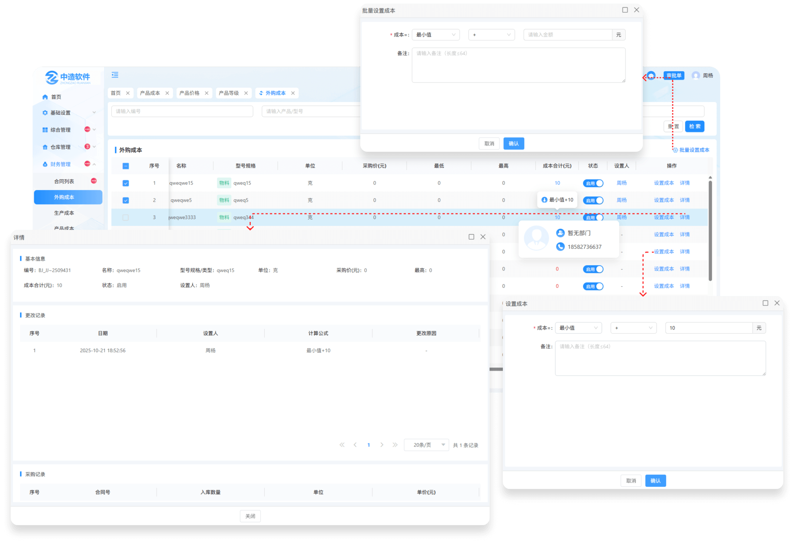

# 外购成本

> "外购成本列表"位于财务管理板块，在"外购成本列表中可设置相对应的成本"

#### 1.批量设置成本

* 先勾选序号前的勾选框，点击批量设置按钮可设置所选成本

#### 2.成本合计

* 设置的成本会带出来到页面，悬浮可查看成本合计详情

#### 3.详情

* 点击详情可查看成本的基本信息，更改记录，采购记录等

* 如果更改了成本设置，会产生记录到详情中查看

#### 4.设置成本

* 点击设置成本按钮设置成本

  -选择成本（最小值，最大值，采购价）

  -最小值（采购时填写最低价）最大值（采购时填写的最高价）

  -可选择加，减，乘 三种算法

  -可手动输入自定义钱数和备注

#### 5.状态

* 启用代表可以使用，停用代表不可使用

#### 6.设置人

* 设置完成本后，页面显示设置人员，鼠标点击人员名称可查看人员的基础信息（部门，电话）

