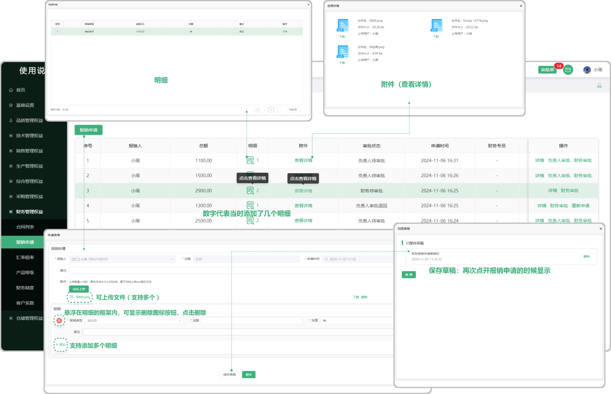

# 报销申请

> "报销申请列表"位于财务管理板块，在"报销申请列表中，可新增报销单子，新增完成以后，页面的操作区域出现：详情、负责人审批、财务审批，同时支持查看明细、附件

#### 1. 如图所示：
* 报销申请：点击 ”报销申请” 可新增报销单子
* 明细：可以添加多个 “明细 ” 同时支持删除（鼠标悬浮在明细框内可显示 "删除图标" 点击删除）
* 保存草稿：在保存草稿以后点击 “报销申请 ”的时候会显示之前所保存的草稿（可删除）
* 明细：是指当时在新增报销申请时添加的明细（可支持添加多个）（对应明细下方图标中显示的数字是指当时添加了多少明细）点击查看
* 附件：是指当时在新增报销申请时上传的文件（支持上传多个）点击查看，可下载

#### 2. 如图所示：
* 详情：点击详情可查看当时添加报销申请的详细信息
* 负责人审批：需要负责人进行审批(分为 “通过”  和  “退回”，果然退回需要重新发起审批 )，审批中支持下载附件，可保存草稿（保存的草稿会在您再次点击这条数据的 “负责人审批“ 时候出现）
* 财务审批：需要财务进行审批(分为 “通过”  和  “退回”，果然退回需要重新发起审批 )，审批中支持下载附件，可保存草稿（保存的草稿会在您再次点击这条数据的 “财务审批“ 时候出现）
* 转账付讫：发起方已经完成了支付，而接收方已经收到相应的款项。这一状态表明资金已经离开发起方的账户，并进入接收方的控制范围，且双方都已确认了资金的正常到账。

